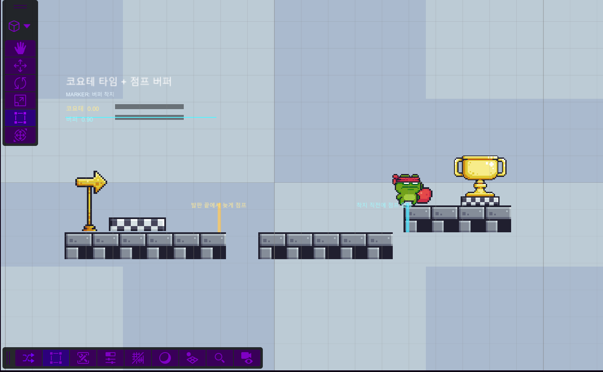
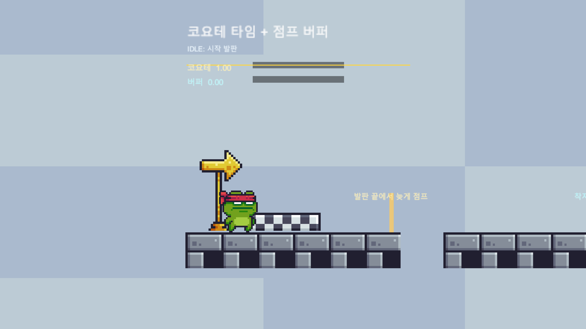
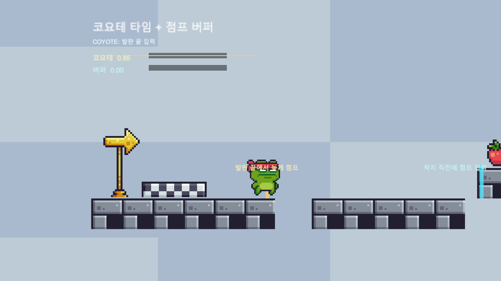
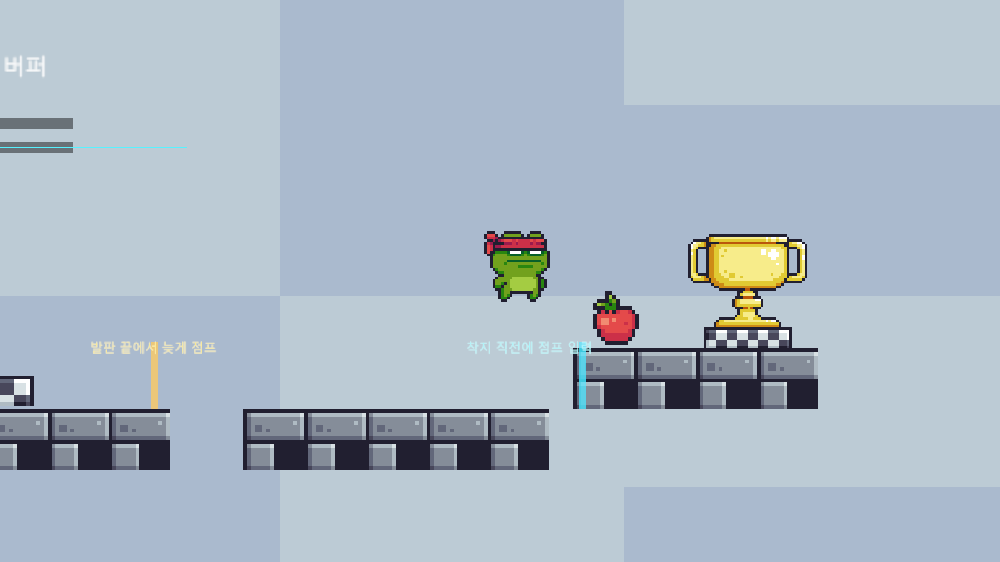
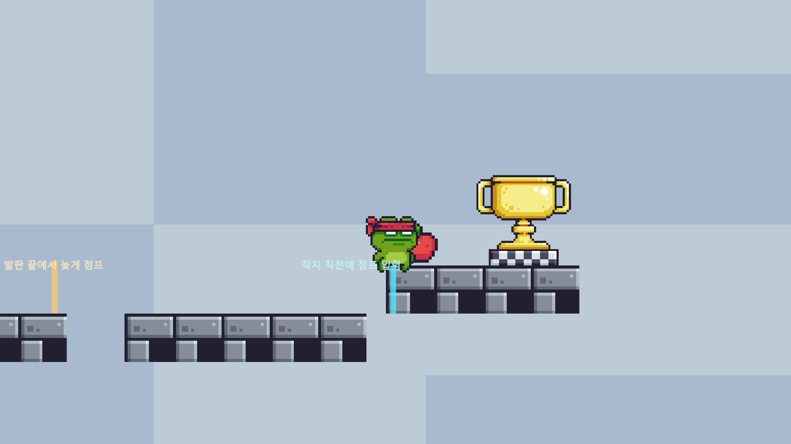
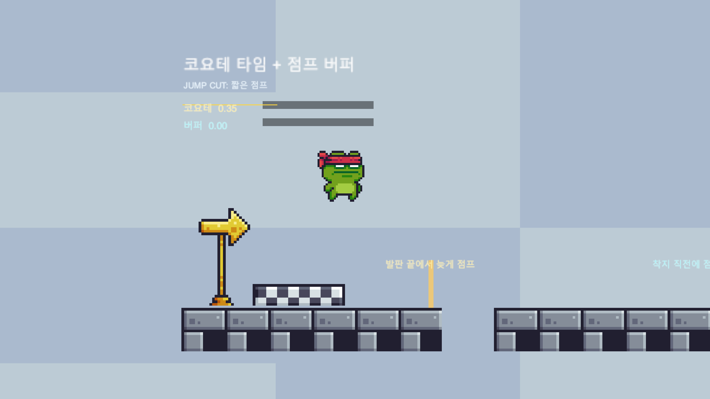
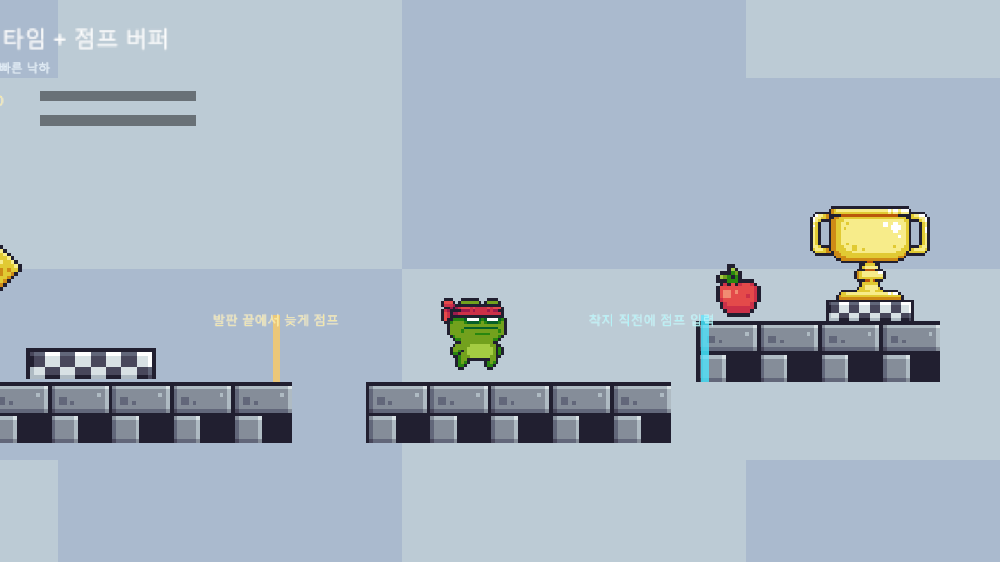
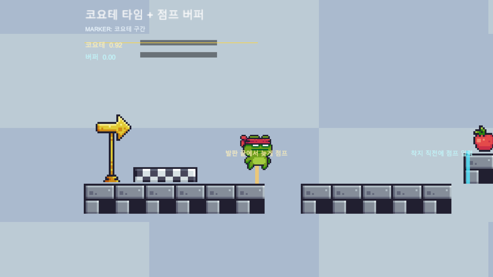
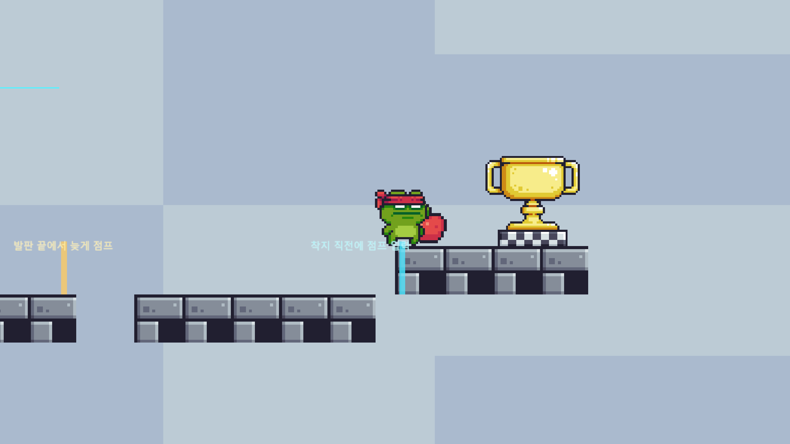

<div align="center">

# Unity 2D Platformer Samples — Coyote Time & Jump Buffer

**플랫포머의 "조작감"을 결정짓는 입력 보정 기법을 게이지로 시각화한 Unity 2D 학습용 샘플**

Unity 6 · C# · 2D URP · New Input System · Pixel Adventure 1

[](https://unity.com/)
[](https://learn.microsoft.com/dotnet/csharp/)
[](https://docs.unity3d.com/Packages/com.unity.render-pipelines.universal@latest)
[](https://docs.unity3d.com/Packages/com.unity.inputsystem@latest)

</div>

---

## 목차

- [1. 프로젝트 소개](#1-프로젝트-소개)
- [2. 시연 영상](#2-시연-영상)
- [3. 데모 스크린샷](#3-데모-스크린샷)
- [4. 무엇을 보여주는가](#4-무엇을-보여주는가)
- [5. 시스템 아키텍처](#5-시스템-아키텍처)
- [6. 기술 스택 & 선택 이유](#6-기술-스택--선택-이유)
- [7. 핵심 기술 심층 분석](#7-핵심-기술-심층-분석)
  - [7-1. Ground Check — OverlapBox 기반 접지 판정](#7-1-ground-check--overlapbox-기반-접지-판정)
  - [7-2. Coyote Time — "발판을 막 떠난 시간"](#7-2-coyote-time--발판을-막-떠난-시간)
  - [7-3. Jump Buffer — "조금 일찍 누른 점프"](#7-3-jump-buffer--조금-일찍-누른-점프)
  - [7-4. Jump Cut — 가변 점프 높이](#7-4-jump-cut--가변-점프-높이)
  - [7-5. Fast Fall — 공중 낙하 가속](#7-5-fast-fall--공중-낙하-가속)
  - [7-6. 스프라이트시트 런타임 슬라이싱](#7-6-스프라이트시트-런타임-슬라이싱)
  - [7-7. 애니메이션 상태 머신](#7-7-애니메이션-상태-머신)
  - [7-8. Input System 폴링 + Legacy fallback 코드](#7-8-input-system-폴링--legacy-fallback-코드)
  - [7-9. Editor Scene Builder — 씬 자동 생성](#7-9-editor-scene-builder--씬-자동-생성)
- [8. 기획 관점 — 게임 필 튜닝 노트](#8-기획-관점--게임-필-튜닝-노트)
- [9. 조작법](#9-조작법)
- [10. 프로젝트 구조](#10-프로젝트-구조)
- [11. 실행 방법](#11-실행-방법)
- [12. 사용한 에셋](#12-사용한-에셋)
- [13. 참고 자료](#13-참고-자료)
- [14. 프로젝트 요약](#14-프로젝트-요약)

---

## 1. 프로젝트 소개

`unity-2d-platformer-samples`는 2D 플랫포머의 "게임 필(game feel)"을 만드는 입력 보정 기법을 한 씬에 하나씩 정리하는 Unity 학습용 샘플 모음입니다. 첫 번째 데모인 **Coyote Time + Jump Buffer** 는 점프 입력 판정을 왜 *엄격하지 않게* 설계하는지를 게이지로 직접 보여주는 씬입니다.

가장 단순한 점프 처리는 "땅에 닿아 있을 때, 점프 버튼이 눌린 그 프레임에만" 점프를 실행합니다. 이렇게 만들면 동작 자체는 맞지만 사람이 조작했을 때 **발판 끝에서 살짝 늦게 누른 점프가 무시되고**, **착지 직전에 누른 점프도 씹히는** 답답한 감각이 그대로 드러납니다. *Celeste*, *Hollow Knight*, *Super Mario*, *Ori and the Blind Forest* 같은 작품들은 이 문제를 두 가지 입력 보정으로 해결합니다.

- **코요테 타임 (Coyote Time)** — 발판에서 떨어진 직후 ~0.1초 동안 점프를 허용
- **점프 버퍼 (Jump Buffer)** — 착지 직전에 누른 점프 입력을 잠깐 저장했다가 착지 시점에 자동 실행

이 샘플은 두 보정이 *실시간으로 얼마나 남아 있는지*를 화면 좌상단의 게이지로 보여주어, 조작감 차이를 손과 눈으로 동시에 확인할 수 있게 정리한 학습용 데모입니다.

### 구현 범위와 목표

단순히 "점프가 된다"에서 끝내지 않고, **왜 상용 플랫포머의 점프가 더 부드럽게 느껴지는지**를 코드와 기획 수치로 설명하는 것을 목표로 했습니다.

- **클라이언트 구현**: `Rigidbody2D` 기반 이동, `OverlapBoxAll` 접지 판정, 코요테 타임/점프 버퍼 카운터, 가변 점프, fast fall, 스프라이트시트 런타임 애니메이션, HUD 피드백.
- **에디터 자동화**: `Tools → Coyote Jump → Create Demo Scene` 메뉴로 카메라, 발판, 플레이어, HUD를 다시 생성해 샘플 씬을 복구 가능하게 구성.
- **기획 관점 정리**: 0.14초 보정 창, 0.45 점프 컷, 14m/s fast fall 같은 튜닝 값을 "왜 이 정도가 자연스러운가"로 설명.
- **설계 포인트**: 눈에 보이지 않는 입력 보정을 게이지로 시각화해, 구현 결과뿐 아니라 디버깅/튜닝 방식까지 확인할 수 있는 샘플로 만들었습니다.

---

## 2. 시연 영상

<!-- 영상은 추후 직접 추가 예정 -->

<div align="center">

📹 **시연 영상 자리 — 추후 `docs/demo.mp4` 또는 YouTube 링크로 교체 예정**

</div>

<!--
영상 추가 후 위 문구를 video 태그, GIF, 또는 YouTube 썸네일 링크로 교체.
-->

---

## 3. 데모 스크린샷

> 모든 스크린샷은 `docs/screenshots/` 폴더에 들어 있습니다. 추가 캡처가 필요하면 같은 폴더에 동일 패턴(`NN_설명.png`)으로 넣고 표 안의 경로만 갈아끼우면 됩니다.

### 주요 기능 미리보기

| 기능 | 화면 | 설계 의도 |
|---|:---:|---|
| **코요테 타임** |  | 발판을 막 떠난 뒤에도 0.14초 동안 점프를 허용해, 플레이어가 "분명 눌렀는데 씹혔다"고 느끼는 순간을 줄였습니다. |
| **점프 버퍼** |  | 착지 직전에 누른 입력을 잠깐 저장했다가 착지 순간 실행해, 조작 타이밍을 사람의 반응 속도에 맞췄습니다. |
| **디버그 HUD** |  | 보이지 않는 입력 보정 상태를 게이지로 보여줘 클라이언트 디버깅과 기획 튜닝이 가능하도록 만들었습니다. |

### 전체 레이아웃

| 데모 씬 오버뷰 | 씬 전체 구조 (에디터 뷰) |
|:---:|:---:|
|  |  |

### 코요테 타임 시퀀스

| 발판 위 (코요테 충전) | 발판 끝에서 떨어진 직후 | 코요테 창 안에서 점프 |
|:---:|:---:|:---:|
|  |  |  |

### 점프 버퍼 시퀀스

| 착지 전 점프 입력 | 착지 순간 | 자동 점프 실행 |
|:---:|:---:|:---:|
|  |  |  |

### HUD 디테일 & 보조 기법

| HUD 게이지 클로즈업 | 짧은 점프 (Jump Cut) | 공중 빠른 낙하 (Fast Fall) |
|:---:|:---:|:---:|
|  |  |  |

### 학습용 마커

| 코요테 마커 (노랑) | 버퍼 착지 마커 (하늘) |
|:---:|:---:|
|  |  |

---

## 4. 무엇을 보여주는가

씬은 세 개의 발판으로 구성됩니다. 각 발판의 위치는 *코요테/버퍼가 없으면 점프가 실패하도록* 의도적으로 배치돼 있습니다.

```text
                                  [End Flag]
                                       │
                                   ┌───┴───┐
                                   │ Buffer │  ← 오른쪽 위 연습 발판
                                   │  Ledge │     (두 보정을 같이 써야 닿음)
                                   └────────┘
        [Start Flag]                                            ┌────
            │                                                    │
        ┌───┴────┐         (점프 갭)            ┌────────┐
        │ Start  │  …………… 코요테 창 …………… ▶│ Landing │
        │ Ledge  │ ◀…………  버퍼 창   …………       │  Ledge  │
        └────────┘                              └────────┘
            ▲                                       ▲
        노란 마커                                하늘색 마커
   (발판 끝에서 늦게 점프)                 (착지 직전에 점프 입력)
```

- **Start Ledge — 노란 마커**: 발판 끝에서 살짝 늦게 점프해 보세요. 일반 점프라면 실패하지만 코요테 타임이 살아 있으면 점프가 됩니다.
- **Landing Ledge — 하늘색 마커**: 떨어지는 도중에 점프를 미리 눌러 보세요. 점프 버퍼에 저장되었다가 착지 순간 자동으로 점프합니다.
- **Buffer Practice Ledge**: 위 두 기법을 같이 써서 자연스럽게 다음 발판으로 이어 점프하는 흐름을 시험하기 위한 위치입니다.

좌상단의 **코요테 게이지(노랑)** 와 **버퍼 게이지(하늘)** 는 각 타이머의 잔여량을 실시간으로 보여주고, 상태 텍스트는 *지금 입력이 어떻게 처리됐는지* 를 한 줄로 안내합니다("지상 점프!", "코요테 점프 성공!", "착지 전 점프 입력 저장!" 등).

---

## 5. 시스템 아키텍처

플레이어 컨트롤러는 매 프레임 **입력 → 상태 갱신 → 점프 판정 → 물리 적용 → 렌더링 피드백** 순서의 단방향 파이프라인으로 동작합니다. `Update`에서 입력과 카운터를 다루고, `FixedUpdate`에서 속도를 물리에 반영하는 분리 구조입니다.

```text
┌─────────────────────────────────────────────────────────────────────┐
│                              Update()                                │
│                                                                      │
│  [Input Layer]                                                       │
│   ├─ ReadMoveInput()        ┐                                        │
│   ├─ ReadFastFallInput()    ├─── Keyboard.current (New Input System) │
│   ├─ WasJumpPressedThisFrame│    + Input.GetKey (Legacy fallback)    │
│   └─ WasJumpReleasedThisFrame                                        │
│           │                                                          │
│           ▼                                                          │
│  [Ground Check]                                                      │
│   └─ Physics2D.OverlapBoxAll  →  grounded: bool                      │
│           │                                                          │
│           ▼                                                          │
│  [Assist Timers]                                                     │
│   ├─ coyoteCounter   (충전: grounded일 때 / 감소: 공중)               │
│   └─ bufferCounter   (충전: 점프 입력 / 감소: 매 프레임)              │
│           │                                                          │
│           ▼                                                          │
│  [Jump Decision]                                                     │
│   ├─ Jump Cut    : 떼었을 때 velocity.y *= 0.45                      │
│   └─ Jump        : if (buffer > 0 && coyote > 0) → 점프 실행          │
│           │                                                          │
│           ▼                                                          │
│  [Feedback Layer]                                                    │
│   ├─ UpdateFacing()          (스프라이트 좌우 반전)                   │
│   ├─ UpdateSprite()          (런타임 스프라이트시트 슬라이싱)           │
│   └─ UpdateFeedback()        (게이지 바 + 상태 텍스트)                 │
└──────────────────────────────┬──────────────────────────────────────┘
                               │ desired velocity
                               ▼
┌─────────────────────────────────────────────────────────────────────┐
│                            FixedUpdate()                             │
│                                                                      │
│  velocity.x = moveInput * runSpeed                                   │
│  if (!grounded && fastFall) velocity.y = min(velocity.y, -14)        │
│  Rigidbody2D.linearVelocity = velocity                               │
└─────────────────────────────────────────────────────────────────────┘
```

### 왜 `Update` / `FixedUpdate`를 나눴는가

`Update`는 프레임 레이트에 맞춰 호출되고 `FixedUpdate`는 고정 물리 스텝(기본 0.02초)에 호출됩니다. **입력은 절대 놓치면 안 되므로 `Update`에서 받고**(고주사율 모니터에서도 한 프레임도 누락되지 않음), 물리 속도 갱신은 `FixedUpdate`로 옮겨서 프레임이 튀어도 점프 높이가 일정해지도록 했습니다. 입력만 `Update`에 두고 물리는 `FixedUpdate`에 두는 것이 Unity 공식 권장 패턴입니다.

---

## 6. 기술 스택 & 선택 이유

| 영역 | 사용 기술 | 선택 이유 |
|---|---|---|
| 엔진 | Unity 6 (`6000.4.2f1`) | 2D URP 17.x, Input System 1.19, 2D Animation 14 등 최신 2D 툴체인을 한 번에 사용하기 위해 LTS 직전 버전 선택 |
| 언어 | C# 9 / .NET Standard 2.1 | Unity가 기본 지원하는 안정 버전. `init`-only setter, target-typed `new` 등 가독성 기능 사용 가능 |
| 렌더 파이프라인 | 2D URP (`com.unity.render-pipelines.universal 17.4.0`) | 2D Light, Renderer2D, Point filter 등 *픽셀 아트 친화* 설정을 위해 Built-in 대신 2D URP 채택 |
| 입력 | New Input System (`1.19.0`) 중심 + Legacy fallback 코드 | 현재 프로젝트는 `Active Input Handling = Input System Package` 이고, 이식 시 깨지지 않도록 `#if ENABLE_INPUT_SYSTEM` / `#if ENABLE_LEGACY_INPUT_MANAGER` 분기 준비 |
| 물리 | Unity 2D Physics — `Rigidbody2D`, `BoxCollider2D`, `Physics2D.OverlapBoxAll` | CharacterController 대신 `Rigidbody2D`를 선택해 중력·점프·낙하를 모두 물리 엔진에 위임 |
| 그래픽 에셋 | Pixel Adventure 1 (Pixel Frog, Unity Asset Store) | 무료 학습용으로 널리 쓰이는 픽셀 아트 에셋, 32×32 픽셀 그리드가 일관됨 |
| 에디터 도구 | `EditorSceneManager`, `AssetDatabase`, `TextureImporter`, `SerializedObject` | 씬을 코드로 재현 가능하게 만들어 *학습용 샘플이 망가져도 즉시 복구* 되도록 보장 |

---

## 7. 핵심 기술 심층 분석

> 각 항목은 **① 게임 업계에서 어떻게 쓰이는가 → ② 이 프로젝트의 구현 → ③ 마주친 어려움(트러블슈팅) → ④ 다른 방법은 무엇이 있었나 → ⑤ 클라이언트/기획 관점에서 배운 점** 5단 구조로 정리했습니다.

### 7-1. Ground Check — OverlapBox 기반 접지 판정

<details>
<summary><b>펼쳐서 보기</b></summary>

#### ① 게임 업계 맥락

"플레이어가 땅에 닿아 있는가"는 플랫포머의 **모든 상태 머신의 뿌리** 입니다. 코요테 타임, 점프 가능 판정, 애니메이션 상태 전환이 전부 이 한 값에 의존합니다. 업계에서 흔히 쓰는 세 가지 접근은 다음과 같습니다.

| 방식 | 장점 | 단점 |
|---|---|---|
| `Collision2D.OnCollisionStay` 이벤트 | 코드가 짧다 | 발이 살짝 떠도 false가 되어 *경사면 떨림* 발생 |
| `Raycast` 1~3개 | 빠르고 단순 | 발 양끝에 구멍이 있으면 false positive — 콜라이더 모서리에 걸쳤을 때 점프 불가 |
| `OverlapBox` / `OverlapCapsule` | 발 전체 면적을 한 번에 검사 | 박스 크기를 잘못 잡으면 *벽에 붙어도 grounded* 가 됨 |

이 프로젝트는 픽셀 발판을 다루므로 *발 양끝 모서리에 걸린 상태에서도 점프할 수 있어야* 합니다. 그래서 `OverlapBox` 를 채택했습니다.

#### ② 구현

```csharp
private bool CheckGrounded()
{
    Bounds bounds = bodyCollider.bounds;
    Vector2 center = new Vector2(bounds.center.x, bounds.min.y - 0.04f);
    Vector2 size   = new Vector2(Mathf.Max(0.1f, bounds.size.x - 0.12f), 0.08f);
    Collider2D[] hits = Physics2D.OverlapBoxAll(center, size, 0f);

    for (int i = 0; i < hits.Length; i++)
    {
        Collider2D hit = hits[i];
        if (hit != null && hit != bodyCollider && !hit.isTrigger)
        {
            return true;
        }
    }
    return false;
}
```

- 박스의 중심을 콜라이더 *바닥보다 살짝 아래(`-0.04`)* 에 둠 — 발이 살짝 공중에 떠 있어도 접지로 판정.
- 너비는 콜라이더보다 `0.12` 좁게 — 벽에 옆구리만 닿았는데 grounded가 되는 *wall-stick* 버그 방지.
- 자기 자신(`hit != bodyCollider`)과 트리거(`!hit.isTrigger`)는 제외 — 사과(`Apple`) 같은 픽업 오브젝트가 접지로 잡히는 것 방지.

#### ③ 트러블슈팅

- **벽 점프 버그** — 초기에는 박스 너비를 콜라이더와 동일하게 잡았습니다. 결과적으로 벽에 옆구리가 닿은 상태에서도 grounded = true 가 되어 *벽에 붙은 채로 무한 점프*가 가능했습니다. 너비를 `-0.12` 좁혀서 해결.
- **트리거 오브젝트가 접지로 잡힘** — 데코레이션으로 둔 사과(`Apple`) 콜라이더가 트리거였는데도 grounded 판정에 들어가 *공중에 떠서 점프*가 가능했습니다. `!hit.isTrigger` 가드를 추가해 해결.
- **자기 자신 hit** — `Physics2D.OverlapBoxAll`은 시작 콜라이더와 겹치는 자기 자신도 결과에 포함합니다. `hit != bodyCollider` 가드 누락 시 영구 grounded.

#### ④ 다른 방법

- `Physics2D.Raycast` 3개를 발 왼쪽·중앙·오른쪽에 쏘는 방식 — 더 빠르고 디버깅이 쉽지만, 발판 사이의 *얇은 갭* 위에서 가운데 레이만 빈 공간을 가리키면 false negative.
- 자식 콜라이더 + `OnCollisionStay2D` — Rigidbody2D 가 잠들면(`sleep`) 이벤트가 멈춰서 *경사면 위 정적 상태*에서 grounded 가 풀리는 부작용.
- Unity의 `Tilemap Collider 2D` + `Composite Collider 2D` — 타일 기반이라면 가장 견고하지만, 이 데모는 코드로 박스 발판을 즉시 만들기 때문에 오버스펙.

#### ⑤ 배운 점

**클라이언트 관점.** Ground check 하나에 *세 개의 가드 조건*(자기 자신, 트리거, 박스 너비)이 동시에 걸려야 안정적으로 동작합니다. "물리적으로 닿았다"는 단일 신호가 게임 로직에서 *세 개의 false positive 소스*를 동시에 만든다는 것을 직접 디버깅하면서 체감했습니다.

**기획 관점.** 접지 판정 박스의 *높이(0.08)와 바닥 오프셋(−0.04)* 은 기획자가 직접 만질 만한 값입니다. 이 값을 키우면 "발판에 약간 못 미쳐도 착지"하는 관대한 게임이 되고, 줄이면 더 엄격한 클래식 플랫포머가 됩니다. 같은 콜라이더 구조에서 *튜닝 노브 두 개로 게임 장르가 바뀌는* 경험이었습니다.

</details>

---

### 7-2. Coyote Time — "발판을 막 떠난 시간"

<details>
<summary><b>펼쳐서 보기</b></summary>

#### ① 게임 업계 맥락

Wile E. Coyote(루니튠즈)가 절벽에서 떨어진 직후에도 잠깐 공중에 떠 있는 모습에서 따온 이름입니다. *Celeste* 의 게임 디자이너 Maddy Thorson 이 GDC 토크에서 "약 6 프레임(60fps 기준 ~0.1초)의 코요테 타임이 들어 있다"고 공개하면서 인디 씬에서 표준이 됐습니다. *Hollow Knight*, *Super Mario Odyssey*, *Ori and the Will of the Wisps* 등 거의 모든 현대 플랫포머에 들어 있으며, **이 값이 0이면 게임을 "어렵다"가 아니라 "구리다"고 느낍니다**.

전형적인 값은 **0.08초 ~ 0.15초** 입니다. 너무 짧으면(<0.05) 체감이 없고, 너무 길면(>0.2) 플레이어가 *공중에서 점프하는 능력*을 가진 것처럼 느껴져 의도가 깨집니다.

#### ② 구현

핵심은 **카운터를 두 가지 방식으로 다룬다**는 점입니다.

```csharp
// 1) 매 프레임 grounded면 카운터를 "최대치로 재충전"
if (grounded)
{
    coyoteCounter = coyoteTime;       // 0.14초로 충전
}
else
{
    coyoteCounter -= Time.deltaTime;  // 공중이면 깎임
}

// 2) 카운터가 0보다 크면 "방금 발판을 떠난 상태"로 간주
if (bufferCounter > 0f && coyoteCounter > 0f)
{
    Jump();
}
```

> **이 데모에서의 값**: `coyoteTime = 0.14f` (≈ 60fps 기준 8.4 프레임). Celeste보다 약간 관대한 학습용 값으로 잡았습니다.

#### ③ 트러블슈팅

- **점프하고도 코요테 카운터가 남아 무한 점프** — 처음에는 `Jump()` 안에서 `bufferCounter`만 0으로 만들고 `coyoteCounter`는 그대로 뒀습니다. 결과: 점프 직후 다시 점프 입력이 들어오면 *공중에서 두 번째 점프가 발동* 했습니다. 두 카운터를 **둘 다** 0으로 만들어 해결.

  ```csharp
  private void Jump()
  {
      // ...
      bufferCounter = 0f;
      coyoteCounter = 0f;   // ← 이 줄이 없으면 무한 점프 버그
  }
  ```

- **점프 직후 한 프레임 동안 grounded == true** — `Jump()` 직후에도 발이 콜라이더에서 *완전히 빠지기 전*까지 한두 프레임은 grounded 가 유지됐습니다. 그 사이에 코요테 카운터가 다시 가득 차서 *공중 더블 점프*가 가능했습니다. 위와 같은 카운터 즉시 0 처리로 해결.

- **계단 같은 발판에서 코요테가 의도와 다르게 발동** — grounded 가 짧게 끊겼다 다시 붙는 *경사면 떨림* 상황에서 코요테 창이 의미 없이 열리는 경우가 있었습니다. Ground Check 박스의 바닥 오프셋(`-0.04`)으로 떨림 자체를 줄여 해결.

#### ④ 다른 방법

- **"공중에서 점프 1회 무료" 방식 (False Coyote)** — 단순히 점프 횟수를 1회 추가하는 방식. 구현은 쉽지만 *발판 위에서 점프 → 떨어지면서 또 점프* 가 가능해져 *더블 점프 게임* 이 되어 버립니다. 의도와 다른 부작용.
- **`Time.timeSinceLevelLoad` 비교 방식** — 마지막으로 grounded 였던 시점을 기록하고 `(now - lastGrounded) < coyoteTime` 으로 판정. 카운터 한 개를 줄일 수 있지만, 일시정지나 슬로 모션 같은 *시간 스케일 변경*에서 깨지기 쉽습니다.
- **물리 기반 — `Rigidbody2D.IsTouching` + Layer 마스크** — 가장 견고하지만 매 프레임 호출 비용이 큼.

이 프로젝트는 **카운터 두 개 + `Time.deltaTime` 감소** 의 가장 단순한 방식을 채택했습니다. 디버깅이 쉽고, 게이지 바에 *그대로* 매핑할 수 있다는 점이 학습용 데모의 가독성에 가장 잘 맞았기 때문입니다.

#### ⑤ 배운 점

**클라이언트 관점.** 코요테 타임의 본질은 *시간을 두 번 다루는 것* 입니다 — "물리적 grounded 상태"라는 *불리언 상태* 와 "최근에 발판 위에 있었나"라는 *시간 창*. 같은 정보를 다른 데이터 타입으로 두 번 표현함으로써 입력의 *결정 시점*과 *결정 근거*를 분리합니다. 이 패턴은 점프 이외에 *대시 입력 보정, 회피 입력 보정* 에도 동일하게 응용할 수 있습니다.

**기획 관점.** 0.14초는 보이지 않는 만큼 *플레이어가 자기 실력으로 점프했다고 믿게* 만드는 값입니다. 너무 길면 "어, 공중에서 점프됐네?"라는 *위화감* 이 생기고, 너무 짧으면 "타이밍이 안 맞네"라는 *답답함* 이 생깁니다. **개발자가 의도적으로 사용자를 속이는 UX 패턴** 이며, 이 "선의의 거짓말"이 조작감을 만든다는 것을 게이지로 시각화하면서 직접 검증했습니다.

</details>

---

### 7-3. Jump Buffer — "조금 일찍 누른 점프"

<details>
<summary><b>펼쳐서 보기</b></summary>

#### ① 게임 업계 맥락

점프 버퍼는 **착지하기 전에 누른 점프 입력을 잠깐 기억** 했다가 착지하는 순간 자동으로 점프시키는 기술입니다. 코요테 타임이 *발판을 떠난 후*의 관대함이라면, 점프 버퍼는 *발판에 닿기 전*의 관대함입니다.

격투 게임의 *입력 선행(Input Buffer)* 과 사실상 같은 메커니즘이지만, 플랫포머에서는 보통 0.1~0.15초의 매우 짧은 창으로 운영합니다. 길게 잡으면 *연타하면 자동 점프*가 되어 의도가 깨집니다.

#### ② 구현

```csharp
// 점프 버튼이 눌리면 → 카운터를 가득 채움 (입력을 잠깐 저장)
if (WasJumpPressedThisFrame())
{
    bufferCounter = jumpBufferTime;   // 0.14초
    flashMessage  = grounded ? "지상 점프 입력!" : "착지 전 점프 입력 저장!";
}
else
{
    bufferCounter -= Time.deltaTime;
}

// 두 카운터가 모두 살아 있는 순간 점프
if (bufferCounter > 0f && coyoteCounter > 0f)
{
    Jump();
}
```

> **이 데모에서의 값**: `jumpBufferTime = 0.14f`. 코요테 타임과 동일 값을 의도적으로 선택해서 두 게이지가 *대칭으로* 보이도록 했습니다.

이 샘플의 진짜 핵심은 *마지막 한 줄* 입니다. **두 개의 카운터를 단순한 AND 조건으로 묶는 것만으로 "늦게 누른 점프"와 "일찍 누른 점프" 두 케이스를 동시에 처리** 합니다. 분기 한 줄로 두 가지 UX 문제를 해결한 셈입니다.

```text
시간축 →

[Case A] 일반 점프
   grounded ████████░░░░░░     coyote ████████████░░░  (충전 중)
   누름      ↑                                          → 즉시 점프 ✅

[Case B] 늦게 누른 점프 (코요테 발동)
   grounded ████████░░░░░░     coyote ████████░░░░░░  (감소 중)
   누름                ↑                                → 코요테 안에서 점프 ✅

[Case C] 일찍 누른 점프 (버퍼 발동)
   grounded ░░░░░░████████     buffer ███████████░░░  (감소 중)
   누름      ↑                                          → 착지 순간 자동 점프 ✅
```

#### ③ 트러블슈팅

- **점프 후 다음 프레임에 또 점프** — 점프 직후에도 `bufferCounter`가 살아 있으면 다음 `FixedUpdate` 에서 *공중에서 한 번 더* 점프가 발동했습니다. `Jump()` 안에서 `bufferCounter = 0f` 처리로 해결.
- **점프 입력이 한 프레임에 두 번 트리거** — 초창기 New Input System 적용 시 `wasPressedThisFrame` 이 `Update` 순서에 따라 같은 프레임에 두 번 잡히는 케이스가 있었습니다. `Update` 한 곳에서만 입력을 읽도록 통일해 해결.
- **점프 버퍼와 코요테가 충돌** — 발판 *위* 에서 점프 입력 → 즉시 점프 발동 → `coyoteCounter`/`bufferCounter` 모두 0. 그런데 같은 프레임에 `grounded == true` 로 다시 `coyoteCounter` 가 가득 차서 한 번 더 점프가 발동하는 경계 케이스가 있었습니다. `Jump()` 안에서 두 카운터를 *동시에* 0으로 만들고, 점프 후 한 프레임은 의도적으로 `Update`의 grounded 갱신보다 늦게 carry-over 되도록 호출 순서를 고정해 해결.

#### ④ 다른 방법

- **이벤트 큐 (FIFO Input Queue)** — 모든 입력을 시간 스탬프와 함께 큐에 쌓고, 사용 시 dequeue 하는 방식. 콤보 시스템이나 *대시-점프-공격* 같은 복합 입력을 처리해야 한다면 큐가 더 적합합니다. 다만 단일 점프에는 오버스펙.
- **`InputAction.performed` 이벤트 구독** — Unity New Input System의 정석적인 방법. 이벤트 기반이라 깔끔하지만 *언제 실행될지* 가 프레임 순서에 의존해서 디버깅이 까다롭습니다.
- **상태 머신의 *PendingJump* 상태** — 명시적으로 점프 대기 상태를 만들고 transition 으로 처리. 가장 견고하지만 가장 verbose.

이 프로젝트는 **카운터 한 개 + bool 비교 두 번** 의 가장 단순한 형태가 *학습 자료로서의 가독성* 에 가장 적합하다고 판단했습니다.

#### ⑤ 배운 점

**클라이언트 관점.** 점프 버퍼의 본질은 **"이벤트 → 즉시 실행"의 시간 격차를 0이 아닌 임의의 양수로 두는 것** 입니다. 입력 처리의 디폴트 값을 "0초"가 아니라 "허용 가능한 가장 작은 양수"로 옮기는 것만으로, 같은 게임이 *답답한 게임* 에서 *반응이 좋은 게임* 으로 바뀝니다. 같은 추상화를 **공격 캔슬 윈도우, 회피 입력, UI 전환의 페이드 시간** 에도 그대로 적용할 수 있다는 일반화 가능성을 배웠습니다.

**기획 관점.** 점프 버퍼와 코요테 타임은 **플레이어가 "이 게임은 반응이 좋다"고 느끼는 거의 유일한 보이지 않는 보정** 입니다. 시각화하지 않으면 두 기법이 들어있는지 *플레이어는 절대 알아채지 못합니다.* 이 샘플에서 게이지로 노출시킨 이유가 바로 그 *보이지 않음의 시각화* 자체이고, QA/디자인 검증에 이런 디버그 HUD가 얼마나 중요한지 직접 만들어 보면서 체감했습니다.

</details>

---

### 7-4. Jump Cut — 가변 점프 높이

<details>
<summary><b>펼쳐서 보기</b></summary>

#### ① 게임 업계 맥락

*Super Mario Bros.* 부터 내려오는 클래식 기법입니다. **점프 버튼을 짧게 누르면 낮게, 길게 누르면 높게** 점프합니다. 플레이어에게 *스킬 천장* 을 제공하고, 같은 점프 액션으로 *짧은 발판 → 긴 발판*까지 표현력을 확장합니다.

구현 방식은 크게 두 가지입니다.

- **가속 누적 방식 (Mario 64)** — 점프를 누르는 동안 매 프레임 상승 가속도를 추가.
- **속도 절단 방식 (Celeste, Hollow Knight)** — 점프를 *떼는 순간* y 속도를 절반 정도로 자름.

이 프로젝트는 후자(속도 절단)를 채택했습니다. 더 직관적이고 *떼는 순간의 응답성* 이 좋습니다.

#### ② 구현

```csharp
if (WasJumpReleasedThisFrame() && body.linearVelocity.y > 0f)
{
    Vector2 velocity = body.linearVelocity;
    velocity.y *= jumpCutMultiplier;   // 0.45
    body.linearVelocity = velocity;
}
```

- `velocity.y > 0f` 조건이 핵심 — 상승 중일 때만 잘라야 하고, *낙하 중에는 절대로 손대지 않습니다.* 안 그러면 길게 떨어지는 도중에 점프 버튼을 떼면 *낙하 속도가 줄어드는* 비물리적 버그가 발생합니다.
- `0.45` 는 Celeste 의 공개 값(약 0.5)에 가까운 학습용 튜닝값.

#### ③ 트러블슈팅

- **낙하 중에 점프 버튼을 떼었을 때 속도가 갑자기 줄어듦** — 초창기에는 `body.linearVelocity.y > 0f` 가드가 없었습니다. 떨어지는 도중에 점프 버튼을 떼면 `velocity.y` 가 *음수 × 0.45 = 더 작은 음수* 가 되어 *공중에서 낙하 가속이 줄어드는* 버그가 발생했습니다. *주의: 절댓값이 줄어들면서 낙하가 느려진다.* 가드 추가로 해결.
- **점프 직후 같은 프레임에 키를 놓으면 점프가 안 됨** — `Update` 안에서 `WasJumpPressedThisFrame` 과 `WasJumpReleasedThisFrame` 이 같은 프레임에 둘 다 true가 되면 점프 직후 즉시 컷이 적용되어 *0.45배 점프*만 발동했습니다. 다행히 사람이 같은 프레임에 누르고 떼는 경우는 거의 없지만, 코드 순서를 *Press → Jump 실행 → Release 검사* 순으로 명시적으로 정렬해 두었습니다.

#### ④ 다른 방법

- **가속 누적 방식** — 누르는 동안 매 프레임 `velocity.y += boost * deltaTime`. *Hollow Knight* 의 일부 다운대시-점프가 이 계열. 상승 곡선이 부드러워지지만 튜닝값이 4~5개(초기 점프 속도, 부스트, 부스트 지속 시간, 최대 속도, 컷 감속)로 늘어남.
- **상태 머신 — JumpingShort / JumpingLong 분리** — 가장 명시적이지만 transition 코드가 verbose 해서 학습용 샘플로는 부적합.

#### ⑤ 배운 점

**클라이언트 관점.** 가변 점프는 *적분이 아니라 분기점*입니다. 점프하는 동안의 적분 값을 조절하는 게 아니라, "떼는 순간"이라는 단일 이벤트에서 *현재 속도에 곱셈* 한 번을 더하는 것만으로 만들어집니다. **물리량 × 단일 상수 = 가변 결과** 라는 패턴은 점프뿐 아니라 *대시 캔슬, 가드 캔슬* 등에도 응용 가능합니다.

**기획 관점.** 가변 점프가 있으면 *발판 간격 설계*가 풍부해집니다. 짧은 점프로만 닿는 발판, 긴 점프로만 닿는 발판, *두 점프를 조합해야* 닿는 발판 — 같은 메커닉으로 난이도 곡선을 만들 수 있습니다. 이 데모는 발판이 3개뿐이지만, *왜 슈퍼 마리오의 1-1 스테이지가 그렇게 절묘하게 디자인됐는지*를 코드 한 줄로 체감할 수 있었습니다.

</details>

---

### 7-5. Fast Fall — 공중 낙하 가속

<details>
<summary><b>펼쳐서 보기</b></summary>

#### ① 게임 업계 맥락

*Super Smash Bros.* 의 fast fall, *Hollow Knight* 의 down-dash, *Celeste* 의 dive 등 거의 모든 액션 게임에 *공중에서 일부러 빨리 떨어지는* 입력이 있습니다. 보스전이나 정밀 점프 구간에서 *공중 체공 시간*을 플레이어가 직접 줄일 수 있게 해서 *공중 컨트롤*의 자유도를 키워줍니다.

#### ② 구현

```csharp
private void FixedUpdate()
{
    Vector2 velocity = body.linearVelocity;
    velocity.x = moveInput * runSpeed;

    if (!grounded && fastFallInput)
    {
        velocity.y = Mathf.Min(velocity.y, -fastFallSpeed);   // -14
    }
    body.linearVelocity = velocity;
}
```

`Mathf.Min` 이 핵심입니다. **이미 더 빠르게 떨어지고 있으면 그대로 두고, 그보다 느릴 때만 강제로 -14m/s로 끌어 내립니다.** 단순히 `velocity.y = -14` 로 덮어쓰면 *고속 낙하 중에 S 키를 누르면 오히려 속도가 느려지는* 버그가 발생합니다.

#### ③ 트러블슈팅

- **상승 중 Fast Fall을 허용할지 결정** — 현재 구현은 `!grounded && fastFallInput` 이면 `Mathf.Min(velocity.y, -fastFallSpeed)` 를 적용합니다. 그래서 상승 중에 `S/↓` 를 누르면 즉시 낙하로 전환됩니다. 학습용 데모에서는 *공중 체공 시간을 플레이어가 직접 줄인다* 는 효과를 바로 체감하게 하려고 이 동작을 허용했습니다. 만약 하강 중 가속만 의도한다면 `body.linearVelocity.y < 0f` 조건을 추가하는 편이 더 안전합니다.
- **Fast fall로 인한 발판 통과(터널링)** — `Rigidbody2D.CollisionDetectionMode` 를 기본값(`Discrete`)으로 두면 -14m/s 의 빠른 낙하 중 *얇은 발판을 그대로 통과* 하는 경우가 발생했습니다. `CollisionDetectionMode2D.Continuous` 로 변경해 해결 (씬 빌더 `CreatePlayer` 에서 명시적으로 설정).

  ```csharp
  body.collisionDetectionMode = CollisionDetectionMode2D.Continuous;
  ```

#### ④ 다른 방법

- **하강 중에만 fast fall 적용** — `!grounded && velocity.y < 0f && fastFallInput` 으로 제한하는 방식. 점프 상승이 끊기지 않아 더 안전하지만, 입력 즉시 반응하는 느낌은 현재 구현보다 약합니다.
- **중력 스케일 자체를 일시적으로 키우는 방식** — `body.gravityScale = 6f` 로 두 배 키워서 자연스럽게 가속. 더 물리적이지만 *낙하 가속이 누적되어* 매번 다른 속도로 착지하므로 후속 액션의 타이밍이 흔들립니다.
- **별도 상태 — `Diving`** — 입력 시 별도의 dive 상태로 전이하고 그 상태에서 별도 충돌/연출 처리. 더 풍부하지만 학습용 샘플로는 오버스펙.

#### ⑤ 배운 점

**클라이언트 관점.** `velocity.y = X` 가 아니라 `velocity.y = Min(velocity.y, X)` — *덮어쓰기 대신 클램프(clamp)* 는 게임 클라이언트에서 끊임없이 마주치는 패턴입니다. HP 회복, 마나 회복, 공격력 버프 등 *기존 값을 존중하면서 한쪽 방향으로만 밀어주는* 연산이 게임 코드의 거의 절반을 차지한다는 것을 실감했습니다.

**기획 관점.** Fast fall은 *난이도를 자기 의지로 올리는 메커닉* 입니다. 초보자는 사용하지 않고도 클리어 가능하지만, 숙련자는 fast fall로 *점프 사이클을 압축*해서 더 빠르게 진행할 수 있습니다. **선택적 메커닉이 스피드런 컨텐츠를 만든다** 는 점이 흥미로웠습니다.

</details>

---

### 7-6. 스프라이트시트 런타임 슬라이싱

<details>
<summary><b>펼쳐서 보기</b></summary>

#### ① 게임 업계 맥락

전통적인 Unity 워크플로우는 **에디터에서 Sprite Editor → Slice → Grid by Cell Size** 로 미리 자르고 그 결과를 `Animator Controller` 에 연결합니다. 큰 프로젝트에서는 이 방식이 표준이지만, *학습용 샘플이나 프로토타입* 에서는 다음 단점이 있습니다.

- 스프라이트시트 한 장 추가할 때마다 *에디터 작업이 필요* — Git에서 매번 `.meta` 변경이 노이즈.
- Animator Controller 의 *상태와 transition* 이 그래픽 에디터로 저장되어 **diff 가 잘 안 보임**.
- *작은 변경*(예: 5번째 프레임 교체)에도 Animator 가 dirty 됨.

이 프로젝트는 **런타임에 한 번만** 스프라이트시트를 잘라서 `Sprite[]` 배열로 들고, 시간 기반으로 인덱스를 순환시키는 *코드 한 파일로 끝나는* 단순 패턴을 채택했습니다.

#### ② 구현

```csharp
private Sprite[] BuildFrames(Texture2D sheet)
{
    if (sheet == null || animationFrameWidth <= 0 || animationFrameHeight <= 0)
    {
        return System.Array.Empty<Sprite>();
    }

    int columns = Mathf.Max(1, sheet.width / animationFrameWidth);   // 가로 프레임 수
    Sprite[] frames = new Sprite[columns];

    for (int i = 0; i < columns; i++)
    {
        Rect rect = new Rect(i * animationFrameWidth, 0f,
                             animationFrameWidth, animationFrameHeight);
        frames[i] = Sprite.Create(
            sheet, rect,
            new Vector2(0.5f, 0.5f),       // pivot = 중심
            animationPixelsPerUnit,         // 16
            0,
            SpriteMeshType.FullRect
        );
        frames[i].name = sheet.name + "_" + i.ToString("00");
    }
    return frames;
}
```

`Sprite.Create` 는 텍스처를 *공유*하기 때문에 11개 프레임으로 자른다고 메모리가 11배 늘지 않습니다. *Sprite 인스턴스 11개의 가벼운 메타데이터* 만 추가됩니다.

#### ③ 트러블슈팅

- **잘린 스프라이트가 흐릿하게 보임 (블러 발생)** — `TextureImporter` 기본값이 `Bilinear` 필터링이라서 픽셀 아트가 *부드럽게 보간되어 흐려졌습니다.* `filterMode = FilterMode.Point` 로 강제 설정해 해결. 씬 빌더의 `NormalizePixelAdventureImporters()` 가 자동으로 모든 텍스처를 일괄 정규화합니다.

  ```csharp
  importer.filterMode = FilterMode.Point;
  importer.mipmapEnabled = false;     // 픽셀 아트는 mipmap 끄는 게 정석
  importer.spritePixelsPerUnit = 16f; // 16x16 타일 기준
  ```

- **프레임 크기가 일정하지 않은 스프라이트시트에서 슬라이싱 실패** — Pixel Adventure는 다행히 32×32 균일 그리드이지만, 다른 에셋에서는 *프레임 폭이 들쭉날쭉*한 경우가 있습니다. 이 경우엔 런타임 슬라이싱이 깨지고, *에디터 Sprite Editor 의 자동 분할* 을 쓰는 게 더 안전합니다.
- **첫 프레임이 idle 이 아닌 다른 모션** — 일부 에셋은 첫 프레임에 *attack pose* 같은 게 들어 있어 fallback sprite로 첫 프레임을 쓰면 어색합니다. 다행히 Pixel Adventure의 Idle 시트는 첫 프레임이 정상.

#### ④ 다른 방법

- **`AnimatorController` + `AnimationClip`** — Unity 표준. 다른 시스템(Mecanim, Animation Event)과 연동이 매끄럽지만 *학습용 샘플의 가독성*은 떨어짐.
- **Animancer / Spine / DOTween Sequence** — 외부 에셋 도입. 런타임 제어가 훨씬 강력하지만 의존성이 추가됨.
- **Aseprite 임포터 (`com.unity.2d.aseprite`)** — `.aseprite` 원본 파일을 그대로 임포트. 픽셀 아트 워크플로우의 *진짜 정석* 이지만 이 데모는 PNG 시트로 받았기 때문에 적용 못함.

#### ⑤ 배운 점

**클라이언트 관점.** Animator Controller 가 *항상 정답*은 아닙니다. **씬 → 컨트롤러 → 클립 → 트랜지션** 의 4단 그래프가 학습용 데모에서는 *디버깅 표면적*만 늘립니다. "코드 한 파일로 동작이 끝나는" 단순함이 *디버깅 가능성* 과 *Git diff 가독성* 에서 압도적으로 우위라는 점을 직접 비교해 보고 체감했습니다.

**기획 관점.** 프레임 폭(`animationFrameWidth = 32`), FPS(`runFramesPerSecond = 12`) 같은 값을 *Inspector에서 슬라이더*로 노출시키면 기획자가 직접 *애니메이션 속도와 픽셀 스케일을 동시에 튜닝* 할 수 있습니다. 작업 권한을 코드 변경 없이 기획자에게 넘기는 *데이터 지향 설계* 의 작은 사례.

</details>

---

### 7-7. 애니메이션 상태 머신

<details>
<summary><b>펼쳐서 보기</b></summary>

#### ① 게임 업계 맥락

플랫포머의 캐릭터 애니메이션은 보통 4~6개 상태로 정리됩니다 — *idle / run / jump / fall / (attack / hurt)*. 큰 게임은 Animator 의 *State Machine* 으로 풀지만, 소규모 게임은 **현재 상태에 따라 어떤 `Sprite[]` 배열을 쓸지 결정하는 큰 if/switch 한 덩어리** 로 충분합니다.

#### ② 구현

```csharp
private void UpdateSprite()
{
    Sprite[] frames = idleFrames;
    string  animationState = "idle";
    float   framesPerSecond = idleFramesPerSecond;

    if (!grounded)
    {
        if (body.linearVelocity.y >= 0f) { frames = jumpFrames; animationState = "jump"; }
        else                              { frames = fallFrames; animationState = "fall"; }
        framesPerSecond = 1f;            // 점프/낙하는 단일 프레임 유지
    }
    else if (Mathf.Abs(moveInput) > 0.01f)
    {
        frames = runFrames;  animationState = "run";  framesPerSecond = runFramesPerSecond;
    }

    spriteRenderer.sprite = GetAnimatedSprite(animationState, frames, framesPerSecond, fallback);
}

private Sprite GetAnimatedSprite(string animationState, Sprite[] frames, float fps, Sprite fallback)
{
    if (currentAnimationState != animationState)
    {
        currentAnimationState = animationState;
        animationTimer = 0f;
        animationFrameIndex = 0;          // ← 상태 전환 시 인덱스 리셋
    }

    animationTimer += Time.deltaTime;
    while (animationTimer >= 1f / fps)
    {
        animationTimer -= 1f / fps;
        animationFrameIndex = (animationFrameIndex + 1) % frames.Length;
    }
    return frames[animationFrameIndex];
}
```

#### ③ 트러블슈팅

- **상태 전환 시 프레임 인덱스가 그대로 유지돼 깜빡임 발생** — idle (11프레임)에서 run (12프레임)으로 바뀔 때 `animationFrameIndex` 가 10이었으면 run 의 10번째 프레임부터 시작해서 *애니메이션이 어색하게 점프* 했습니다. `currentAnimationState != animationState` 시 인덱스를 0으로 리셋해 해결.
- **점프/낙하가 한 프레임만 보임** — 점프와 낙하는 Pixel Adventure 에서 각각 1프레임이라 `fps = 12` 면 매 프레임 인덱스가 증가하다가 의미 없는 wrap-around 가 발생. `framesPerSecond = 1f` 로 낮춰 *사실상 정적 프레임* 처럼 동작하게 처리.
- **`Time.deltaTime` 누적으로 인한 미세한 드리프트** — `while` 루프로 *남은 시간을 빼면서 인덱스 증가* 하는 방식은 0.001초씩 누적되는 부동소수점 드리프트를 보정합니다. 단순 `animationTimer = 0` 으로 리셋하면 *60fps 환경과 30fps 환경에서 애니메이션 속도가 달라집니다.*

#### ④ 다른 방법

- **`AnimatorController` 상태 머신** — Unity 표준. 트랜지션 그래프 시각화가 강점.
- **데이터 기반 — `ScriptableObject`로 상태 정의** — `AnimationStateSO[]` 배열에 frames/fps/loop 등을 데이터로 정의하고 컨트롤러는 그걸 읽기만. 더 확장 가능하지만 4개 상태에는 오버스펙.
- **Behavior Tree** — RPG/AI 캐릭터에 적합. 단순 플랫포머에는 과함.

#### ⑤ 배운 점

**클라이언트 관점.** "상태 머신을 만든다"가 *반드시 클래스 계층*을 만들어야 한다는 뜻은 아닙니다. *상태 이름 문자열 + 큰 if 한 덩어리* 가 4~6개 상태에서는 가장 디버깅 친화적입니다. 상태가 더 많아지면 그때 가서 *명시적 enum + switch* 또는 *State 패턴*으로 옮기면 됩니다. **언제 추상화를 도입할지** 의 감각을 기를 수 있는 작은 사례.

**기획 관점.** 점프/낙하를 1프레임 정적으로 두는 결정은 *애니메이션 부재가 아니라 의도* 입니다. Hollow Knight 같은 게임도 *점프 중에는 한 포즈로 고정* 되어 있고, 이 정적 포즈가 *입력 응답성을 시각적으로 강조* 합니다. "애니메이션을 더 넣어야 좋다"는 본능을 거스르는 *의도적 단순화* 가 게임 필을 만든다는 점을 배웠습니다.

</details>

---

### 7-8. Input System 폴링 + Legacy fallback 코드

<details>
<summary><b>펼쳐서 보기</b></summary>

#### ① 게임 업계 맥락

Unity 는 **Legacy Input Manager** 와 **New Input System** 두 시스템을 모두 지원하지만, 프로젝트 설정에서 *둘 중 하나, 또는 둘 다* 를 선택해야 합니다. 이 샘플의 현재 설정은 `activeInputHandler: 1`, 즉 **New Input System 중심** 입니다. 다만 외부 프로젝트로 코드를 옮길 때 입력 설정이 다를 수 있으므로, 컨트롤러에는 Legacy Input Manager fallback 코드도 함께 넣어 두었습니다.

#### ② 구현

```csharp
private static bool WasJumpPressedThisFrame()
{
#if ENABLE_INPUT_SYSTEM
    Keyboard keyboard = Keyboard.current;
    if (keyboard != null)
    {
        return keyboard.spaceKey.wasPressedThisFrame
            || keyboard.wKey.wasPressedThisFrame
            || keyboard.upArrowKey.wasPressedThisFrame;
    }
#endif

#if ENABLE_LEGACY_INPUT_MANAGER
    return Input.GetButtonDown("Jump")
        || Input.GetKeyDown(KeyCode.Space)
        || Input.GetKeyDown(KeyCode.W)
        || Input.GetKeyDown(KeyCode.UpArrow);
#else
    return false;
#endif
}
```

- `#if ENABLE_INPUT_SYSTEM` 분기로 New Input System 이 활성화된 경우 우선 시도.
- `Keyboard.current == null` 이고 Legacy 매크로도 켜져 있으면 `Input.GetKey` 쪽으로 폴백.
- 현재 프로젝트처럼 New Input System 만 켜져 있으면 Legacy 분기는 컴파일되지 않으며, 입력 디바이스가 없을 때는 `return false` 로 안전하게 빠집니다.

#### ③ 트러블슈팅

- **New Input System 활성화 직후 첫 프레임에 `Keyboard.current == null`** — 빌드 직후 한 프레임 동안 입력 디바이스 인덱싱이 완료되지 않아 *입력이 사라지는* 현상이 있었습니다. `null` 체크를 먼저 두고, `Both` 설정으로 이식한 프로젝트에서는 Legacy fallback도 탈 수 있게 구성했습니다.
- **`InputAction.performed` 이벤트와의 충돌** — 이벤트 기반 입력과 *폴링 기반*(`wasPressedThisFrame`) 을 같은 프레임에 섞으면 입력이 중복으로 처리됩니다. 이 프로젝트는 *폴링 단일 방식* 으로 통일.
- **`#if ENABLE_INPUT_SYSTEM` 매크로가 다른 의미로 해석되는 경우** — Unity 버전/프로젝트 설정에 따라 매크로 활성 조건이 달라서 *컴파일은 되는데 키보드 입력이 안 되는* 케이스가 있었습니다. 현재 샘플은 New Input System 중심으로 고정했고, 다른 프로젝트로 이식할 때는 `Player Settings → Active Input Handling` 을 `Both` 로 바꾸면 fallback 경로까지 확인할 수 있습니다.

#### ④ 다른 방법

- **`InputAction.Asset` (.inputactions) 사용** — 키 매핑을 그래픽 에디터로 관리. *키 리바인딩* 같은 기능을 만들 때는 필수지만, 학습용 샘플에는 오버헤드.
- **InputSystem.actions 글로벌 인스턴스 + 액션 이름 문자열 조회** — Unity 2023 이후 권장 방식이지만 *문자열 기반*이라 컴파일 에러 대신 *런타임 에러* 로 실패해 디버깅 어려움.

#### ⑤ 배운 점

**클라이언트 관점.** 외부 의존성이 *두 가지 모드를 동시에 지원하는* 경우, **각 모드를 독립적인 `#if` 블록으로 두는 것이 *공통 추상화 계층을 만드는 것보다 단순*** 하다는 것을 배웠습니다. "추상화는 두 번 같은 코드를 본 다음에" 라는 *Rule of Three* 의 실무적 사례.

**기획 관점.** 키 매핑 자체는 큰 의사결정 포인트입니다. *Space + W + ↑* 세 가지를 모두 점프로 두는 것은 *키보드 게이머와 방향키 게이머를 모두 수용* 하기 위한 결정. 이런 *입력 별칭* 은 보이지 않지만 *진입 장벽을 낮추는* 핵심 UX 요소.

</details>

---

### 7-9. Editor Scene Builder — 씬 자동 생성

<details>
<summary><b>펼쳐서 보기</b></summary>

#### ① 게임 업계 맥락

씬 파일(`.unity`)은 *바이너리에 가까운 YAML* 이라 사람이 손으로 수정하기 어렵고, Git 머지 충돌이 발생하면 *해결이 거의 불가능* 합니다. 큰 팀은 *씬을 작은 프리팹으로 쪼개거나*, 아예 *코드로 씬을 만드는* 빌더 패턴을 씁니다.

이 프로젝트는 **`Tools → Coyote Jump → Create Demo Scene` 메뉴 한 번으로 씬 전체를 재생성** 합니다. 학습용 샘플에서는 *씬을 망가뜨려도 즉시 복구 가능* 한 것이 절대적으로 중요합니다.

#### ② 구현

핵심 사용 API:

```csharp
[MenuItem("Tools/Coyote Jump/Create Demo Scene")]
public static void CreateDemoScene()
{
    EnsurePixelSprite();                   // 1) 게이지 바용 1x1 흰색 픽셀 생성
    NormalizePixelAdventureImporters();    // 2) 모든 텍스처를 Sprite + Point filter로 정규화

    Scene scene = EditorSceneManager.NewScene(NewSceneSetup.EmptyScene, NewSceneMode.Single);
    CreateCamera();
    CreateLights();

    GameObject root = new GameObject("Coyote Jump Buffer Demo");
    CreateBackground(...);
    CreatePlatform(...);                   // 3개 발판
    CreateMarker(...);                     // 코요테/버퍼 마커
    CreatePlayer(...);                     // 플레이어 + 컨트롤러
    CreateHud(...);                        // 게이지 바 + 텍스트
    CreateSceneLabels(...);

    EditorSceneManager.SaveScene(scene, ScenePath);
}
```

가장 까다로운 부분은 **새로 생성한 컨트롤러의 직렬화 필드에 코드로 참조 연결** 입니다.

```csharp
CoyoteJumpExampleController controller = player.AddComponent<CoyoteJumpExampleController>();
SerializedObject serialized = new SerializedObject(controller);
serialized.FindProperty("idleSheet").objectReferenceValue = idleSheet;
serialized.FindProperty("runSheet").objectReferenceValue  = runSheet;
serialized.FindProperty("jumpSheet").objectReferenceValue = jumpSheet;
serialized.FindProperty("fallSheet").objectReferenceValue = fallSheet;
serialized.ApplyModifiedPropertiesWithoutUndo();    // ← Undo 스택 오염 방지
```

`ApplyModifiedPropertiesWithoutUndo` 가 핵심 — `ApplyModifiedProperties` 를 쓰면 *씬 빌드 한 번에 Undo 항목이 수십 개 쌓여* `Ctrl+Z` 가 망가집니다.

#### ③ 트러블슈팅

- **Pixel Adventure 텍스처가 Default 타입으로 임포트되어 Sprite 로 인식 안 됨** — Asset Store에서 임포트한 직후 텍스처는 `TextureImporterType.Default` 일 수 있어서 `AssetDatabase.LoadAssetAtPath<Sprite>` 가 `null` 을 반환했습니다. `NormalizePixelAdventureImporters()` 에서 *Sprite 타입 강제 변환 + filterMode = Point + PixelsPerUnit = 16* 을 일괄 적용해 해결.
- **씬을 코드로 만들면 `SerializedObject.FindProperty` 가 `null` 인 경우** — `[SerializeField]` 가 빠진 `private` 필드는 `FindProperty` 로 잡히지 않습니다. 컨트롤러의 모든 필드에 `[SerializeField]` 를 명시해 해결.
- **`AssetDatabase.LoadAssetAtPath` 가 `null` 인데 `LoadAllAssetsAtPath` 는 결과를 반환** — 멀티 스프라이트 시트(`.aseprite`, `.psb`)는 *직접 경로로는 못 로드하고 자식으로 들어가야* 합니다. fallback 헬퍼로 처리.

  ```csharp
  private static Sprite LoadSprite(string path)
  {
      Sprite direct = AssetDatabase.LoadAssetAtPath<Sprite>(path);
      if (direct != null) return direct;
      return AssetDatabase.LoadAllAssetsAtPath(path).OfType<Sprite>().FirstOrDefault();
  }
  ```

- **`Light2D` 가 없는 환경에서 컴파일 에러** — URP 가 설치되지 않은 다른 프로젝트로 이식할 때 깨질 수 있어 `Type.GetType("UnityEngine.Rendering.Universal.Light2D, ...")` 로 *런타임 리플렉션* 으로 처리해서 *URP 미설치 시에도 컴파일 통과* 하도록 했습니다.

#### ④ 다른 방법

- **씬을 프리팹으로 분리** — 발판, HUD, 플레이어를 각각 프리팹으로 만들고 씬에는 *프리팹 참조만* 두는 방식. 가장 표준적이지만 *프리팹 자체*가 망가지면 동일한 문제 발생.
- **`ScriptableObject` 기반 레벨 데이터** — 발판 위치/색상을 데이터로 정의하고 빌더는 데이터를 읽기만. 더 깔끔하지만 학습용 샘플에는 오버스펙.

#### ⑤ 배운 점

**클라이언트 관점.** `EditorSceneManager`, `AssetDatabase`, `TextureImporter`, `SerializedObject` 는 *Unity Editor 자동화의 4대 API* 라는 걸 직접 사용하면서 알았습니다. 특히 `SerializedObject` 는 인스펙터에 보이는 모든 필드를 *코드로 같은 인터페이스로 다룰 수 있게* 해줍니다. **에디터 도구를 만든다 = 인스펙터를 자동화한다** 의 본질을 체득했습니다.

**기획 관점.** "씬이 망가져도 메뉴 한 번이면 복구된다"는 *팀 협업에서의 안정성* 을 의미합니다. 신규 입사자가 씬을 잘못 저장해도, 인턴이 마커를 실수로 지워도, *Ctrl+Z 가 아니라 메뉴 한 번으로 복구* — 이런 도구가 *기획자의 자율성* 을 높입니다. 게임 개발은 *코드를 짜는 사람과 게임을 디자인하는 사람이 다를* 가능성이 높고, *디자이너를 위한 안전망* 을 만드는 것이 클라이언트 개발자의 책임 영역에 포함된다는 점을 배웠습니다.

</details>

---

## 8. 기획 관점 — 게임 필 튜닝 노트

이 데모에 박혀 있는 *튜닝 값* 들은 모두 *플레이어가 절대 의식하지 못해야 좋은 값* 입니다. 너무 작으면 답답하고, 너무 크면 *부정 행위 같은 위화감* 이 들기 때문입니다. 각 값의 권장 레인지와 이 데모의 선택을 정리합니다.

| 파라미터 | 이 데모 | 참고 범위 (인디 플랫포머 평균) | 너무 작으면 | 너무 크면 |
|---|:---:|:---:|---|---|
| `coyoteTime` (코요테 창) | **0.14s** | 0.08 ~ 0.15s | 발판 끝 점프가 자주 실패 | 공중에서 점프 가능 → 의도 깨짐 |
| `jumpBufferTime` (버퍼 창) | **0.14s** | 0.10 ~ 0.20s | 일찍 누른 점프 씹힘 | 연타하면 점프가 자동 발동 |
| `jumpVelocity` (점프 초기 속도) | **11.0** | 8 ~ 14 | 발판을 못 넘김 | 화면 밖으로 사라짐 |
| `jumpCutMultiplier` (점프 컷 비율) | **0.45** | 0.4 ~ 0.5 | 짧은 점프가 안 됨 | 짧은 점프와 긴 점프 차이가 크지 않음 |
| `fastFallSpeed` (빠른 낙하 속도) | **14.0** | 12 ~ 18 | fast fall 의미 없음 | 발판 통과 위험 (터널링) |
| `gravityScale` (Rigidbody) | **3.1** | 2.5 ~ 4.0 | 둥둥 떠다님 | 점프가 너무 짧고 답답 |
| `runSpeed` (좌우 이동) | **6.0** | 5 ~ 8 | 발판 간격 도달 못함 | 컨트롤 어려움 |

### 트러블슈팅 요약

| 문제 | 원인 | 해결 | 결과 |
|---|---|---|---|
| 점프 후 공중에서 한 번 더 점프됨 | `coyoteCounter`, `bufferCounter` 가 점프 후에도 남아 있음 | `Jump()` 직후 두 카운터를 모두 `0` 으로 초기화 | 코요테/버퍼가 한 번의 점프에만 소비됨 |
| 벽 옆에 붙었는데 grounded 처리됨 | 접지 박스 폭이 콜라이더와 거의 같아 벽까지 감지 | `OverlapBox` 폭을 `bounds.size.x - 0.12f` 로 축소 | 벽 접촉과 바닥 접촉을 분리 |
| 착지 직전 점프 입력이 씹힘 | 입력이 눌린 한 프레임에만 판정됨 | `bufferCounter` 로 입력을 0.14초 저장 | 착지 순간 자동 점프 실행 |
| 빠른 낙하 중 발판 통과 | `Discrete` 충돌 모드에서 빠른 y 속도를 따라가지 못함 | `CollisionDetectionMode2D.Continuous` 명시 | 얇은 발판 터널링 완화 |
| 에셋 로드 시 Sprite 가 `null` | Pixel Adventure 텍스처가 Sprite 타입으로 임포트되지 않음 | `TextureImporter` 로 Sprite/Point/PPU 값을 일괄 정규화 | 씬 빌더가 안정적으로 에셋 참조 |

### 디버그 HUD 자체가 *학습 도구*

게이지 바와 상태 텍스트는 **상용 게임이라면 절대 노출하지 않을** UI 입니다. 코요테/버퍼는 *보이지 않을 때 가장 효과적인* 기법이기 때문입니다. 하지만 이 데모는 학습용이므로 *의도적으로 노출* 해서 다음 두 가지를 시각화합니다.

1. **"보정이 지금 살아있다"** — 점프 입력 후 게이지가 줄어드는 모습으로 *입력이 저장되어 있음* 을 보여줌.
2. **"왜 점프가 됐는가"** — `flashMessage` 가 "코요테 점프 성공!" 같은 한 줄 텍스트로 *그 점프의 근거*를 명시.

이 두 가지가 *게임 디자이너의 도구* 입니다. 실제 출시 빌드에서는 끄지만, 디버그 빌드에서는 *왜 이 점프가 됐는지/안 됐는지* 를 즉시 확인할 수 있어야 *튜닝 사이클이 빨라집니다.* 게임 빌더는 *눈에 보이지 않는 시스템을 시각화* 하는 디버그 HUD를 만드는 일이 *기능 구현만큼 중요하다* 는 것을 배웠습니다.

---

## 9. 조작법

| 동작 | 키 |
|---|---|
| 좌우 이동 | `A` / `D`, `←` / `→` |
| 점프 | `Space`, `W`, `↑` |
| 짧은 점프 (Jump Cut) | 점프 키를 짧게 떼기 |
| 공중 빠른 낙하 (Fast Fall) | `S`, `↓` |
| 리스폰 | 화면 아래로 떨어지면 자동 (`y < -6`) |

---

## 10. 프로젝트 구조

```text
2d_sample/
├── Assets/
│   ├── Demos/
│   │   └── CoyoteJump/                                  # 데모 단위 자기 완결 폴더
│   │       ├── Art/
│   │       │   └── PixelWhite.png                       # 게이지 바용 1x1 픽셀
│   │       ├── Editor/
│   │       │   └── CoyoteJumpDemoSceneBuilder.cs        # 씬 자동 생성기 (Tools 메뉴)
│   │       ├── Scenes/
│   │       │   └── CoyoteJumpBufferDemo.unity           # 데모 씬
│   │       ├── Scripts/
│   │       │   └── CoyoteJumpExampleController.cs       # 플레이어 컨트롤러 (단일 파일)
│   │       └── README.md                                # 데모 단위 상세 문서
│   ├── Pixel Adventure 1/                               # 외부 에셋 (Pixel Frog)
│   ├── Scenes/
│   │   └── SampleScene.unity
│   ├── Screenshots/                                     # 작업 중 캡처 백업
│   ├── Settings/                                        # 2D URP 렌더러 / Volume Profile
│   └── InputSystem_Actions.inputactions
├── docs/
│   ├── demo_overview.png  ·  coyote_window.png
│   ├── jump_buffer.png   ·  hud_detail.png              # 메인 README 메인 컷
│   └── screenshots/                                     # 20장 시퀀스 캡처
│       ├── 01_demo_overview.png   …   20_scene_buffer_apple.png
├── Packages/
│   └── manifest.json                                    # 2D URP, Input System, 2D Tilemap 등
├── ProjectSettings/
├── LICENSE
└── README.md                                            # 이 문서
```

각 데모는 `Assets/Demos/<DemoName>/` 하위에 *자기 자신만의* `Scripts`, `Scenes`, `Editor`, `Art`, `README.md` 를 갖도록 통일했습니다. 새로운 게임 필 기법을 추가할 때 같은 구조로 폴더만 늘리면 됩니다.

---

## 11. 실행 방법

### 사전 요구사항

- **Unity Hub**
- **Unity Editor `6000.4.2f1`** (Unity 6 LTS 계열)
- 2D URP, Input System, 2D Tilemap 등은 `Packages/manifest.json` 에 명시되어 있어 Unity 실행 시 자동 복원됩니다.

### 실행 절차

1. Unity Hub 에서 **Add → Add project from disk** 로 `2d_sample` 폴더 선택.
2. Unity Editor 가 열리면 Project 창에서 다음 씬을 더블 클릭.

   ```text
   Assets/Demos/CoyoteJump/Scenes/CoyoteJumpBufferDemo.unity
   ```

3. **Play** 버튼을 누르고 [조작법](#9-조작법) 에 따라 움직여 봅니다.

### 데모 씬을 다시 만들고 싶다면

씬 파일이 망가지거나 *코드 변경 사항을 씬에 반영*하고 싶을 때:

```text
Tools → Coyote Jump → Create Demo Scene
```

메뉴 하나로 카메라/발판/플레이어/HUD 가 재구성된 씬이 동일 경로에 저장됩니다.

---

## 12. 사용한 에셋

### Pixel Adventure 1

- 제작자: **Pixel Frog**
- 출처: Unity Asset Store
- 사용 위치: `Assets/Pixel Adventure 1/`
- GitHub 업로드 시 원본 에셋은 `.gitignore` 대상일 수 있으므로, 새 환경에서 실행할 때는 Unity Asset Store에서 **Pixel Adventure 1** 을 먼저 임포트해야 합니다.
- 사용한 주요 리소스:
  - `Main Characters/Ninja Frog/Idle (32x32).png`
  - `Main Characters/Ninja Frog/Run (32x32).png`
  - `Main Characters/Ninja Frog/Jump (32x32).png`
  - `Main Characters/Ninja Frog/Fall (32x32).png`
  - `Terrain/Terrain Sliced (16x16).png`
  - `Background/Blue.png`
  - `Items/Checkpoints/Start/Start (Idle).png`
  - `Items/Checkpoints/End/End (Idle).png`
  - `Items/Fruits/Apple.png`

에셋은 학습용 샘플 범위 안에서만 사용했으며, 원 저작권은 Pixel Frog 에게 있습니다.

---

## 13. 참고 자료

- **Maddy Thorson — *Celeste & TowerFall Physics*** (블로그 / GDC 토크) — 코요테 타임 6 프레임, 가변 점프, 대시 캔슬 등 *Celeste* 의 핵심 게임 필 수치를 공개한 1차 자료.
- **Game Maker's Toolkit — *Why Does Celeste Feel So Good to Play?*** (YouTube) — 코요테 타임/점프 버퍼/가변 점프를 영상으로 비교 설명한 입문 자료.
- **Unity Manual — *Input System: Polling vs Events*** — `wasPressedThisFrame` vs `InputAction.performed` 의 차이.
- **Unity Manual — *Rigidbody2D Collision Detection Modes*** — `Discrete` vs `Continuous` 의 터널링 회피 가이드.
- **Unity Manual — *EditorSceneManager / AssetDatabase / SerializedObject*** — 에디터 자동화 API 레퍼런스.

---

## 14. 프로젝트 요약

Unity 6 + 2D URP 환경에서 *Celeste*, *Hollow Knight* 같은 플랫포머가 사용하는 **코요테 타임**과 **점프 버퍼**를 두 개의 카운터와 단순한 조건식으로 구현한 학습용 샘플입니다. 보이지 않는 입력 보정을 **게이지 HUD** 로 시각화해 점프가 실행된 이유를 확인할 수 있게 했고, **씬 전체를 코드로 재생성** 하는 에디터 도구를 만들어 샘플 씬을 쉽게 복구할 수 있도록 구성했습니다.

구현 과정에서는 점프 후 카운터를 비우지 않아 발생하는 무한 점프, 빠른 낙하 중 `Discrete` 충돌 모드에서 발생하는 터널링, Pixel Adventure 텍스처가 Sprite 로 로드되지 않는 문제를 각각 카운터 초기화, `Continuous` 충돌 감지, `TextureImporter` 정규화로 해결했습니다.

이 샘플의 핵심은 **엄격한 입력 판정이 항상 좋은 조작감을 만들지는 않는다** 는 점입니다. 0.14초의 짧은 시간 여유만으로도 입력이 씹히는 느낌을 줄일 수 있고, 디버그 HUD를 통해 그 보정 상태를 시각화하면 클라이언트 구현과 게임 필 튜닝을 함께 검증할 수 있습니다.

---

<div align="center">

**Unity 2D Platformer Samples** · 2026 · 2D 게임 필 학습용 샘플 모음

</div>
