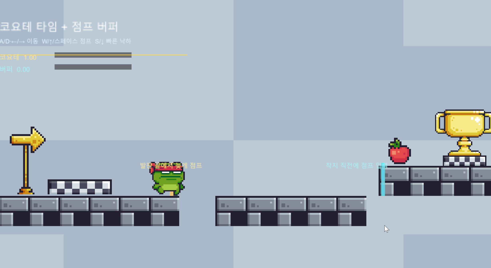
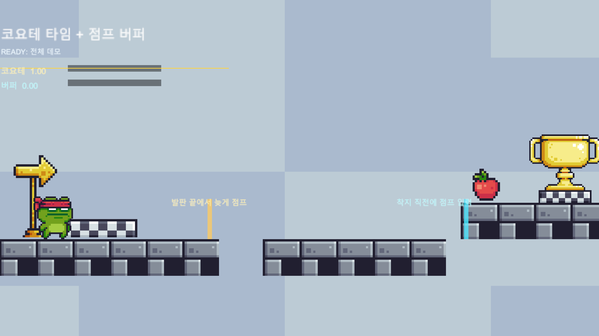
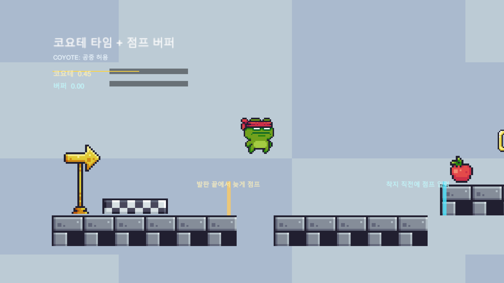
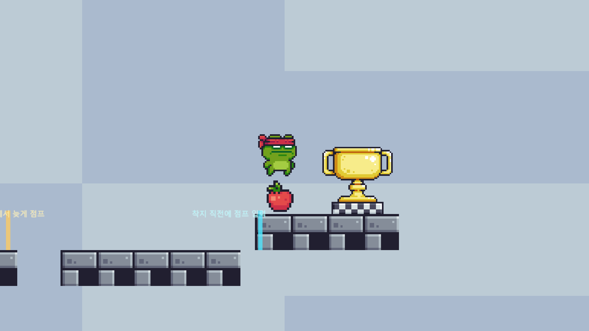
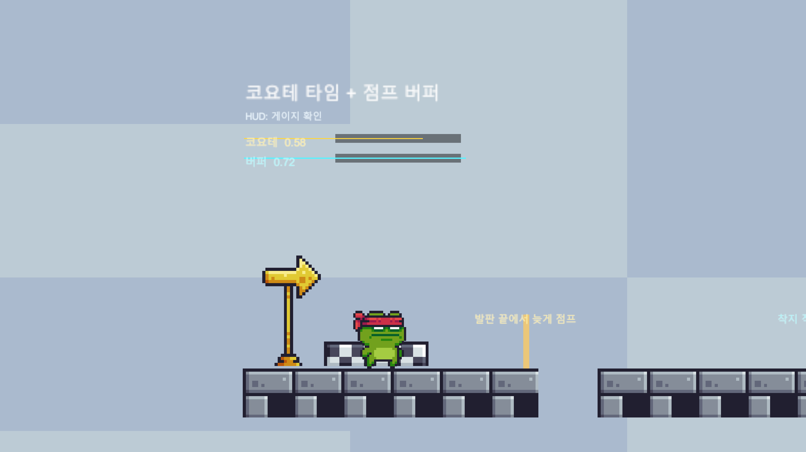

# Unity 2D Platformer Samples - Coyote Time & Jump Buffer

> 2D 플랫포머에서 점프 입력이 씹히는 느낌을 줄이기 위해 코요테 타임, 점프 버퍼, 점프 컷, 빠른 낙하를 한 씬에서 확인할 수 있게 만든 Unity 2D 조작감 샘플입니다.


## 목차

- [프로젝트 개요](#프로젝트-개요)
- [방향성](#방향성)
- [데모](#데모)
- [데모 흐름](#데모-흐름)
- [핵심 구현](#핵심-구현)
- [기술 상세](#기술-상세)
- [트러블슈팅](#트러블슈팅)
- [개발 메모](#개발-메모)
- [확장 방향](#확장-방향)
- [프로젝트 구조](#프로젝트-구조)
- [실행 방법](#실행-방법)
- [에셋 및 라이선스](#에셋-및-라이선스)
- [현재 한계와 다음 개선](#현재-한계와-다음-개선)

## 프로젝트 개요

이 프로젝트는 2D 플랫포머에서 자주 쓰이는 점프 보정 기법을 작은 데모 씬으로 정리한 샘플입니다. 플레이어는 세 개의 발판을 이동하면서 발판 끝에서 늦게 누른 점프, 착지 직전에 미리 누른 점프, 짧게 끊는 점프, 빠른 낙하를 직접 확인할 수 있습니다.

단순한 점프는 "땅에 닿은 상태에서, 점프 키를 누른 그 프레임"에만 실행됩니다. 이렇게 만들면 정확하긴 하지만 실제 플레이에서는 발판 끝에서 살짝 늦게 누른 입력이나 착지 직전에 누른 입력이 자주 무시됩니다. 이 데모는 그 문제를 짧은 시간 여유로 보정하고, 남은 시간을 HUD 게이지로 보여줍니다.

| 구분 | 내용 |
| --- | --- |
| 장르 | Unity 2D 플랫포머 조작감 샘플 |
| 엔진 | Unity 6000.4.2f1 |
| 렌더링 | Universal Render Pipeline 17.4.0 |
| 입력 | New Input System 1.19.0, Legacy fallback 코드 |
| 물리 | `Rigidbody2D`, `BoxCollider2D`, `Physics2D.OverlapBoxAll` |
| 메인 씬 | `Assets/Demos/CoyoteJump/Scenes/CoyoteJumpBufferDemo.unity` |
| 메인 스크립트 | `Assets/Demos/CoyoteJump/Scripts/CoyoteJumpExampleController.cs` |
| 씬 생성 도구 | `Assets/Demos/CoyoteJump/Editor/CoyoteJumpDemoSceneBuilder.cs` |
| 공개 범위 | Unity 프로젝트 설정, 데모 코드, README용 GIF/스크린샷 포함. Pixel Adventure 원본 에셋은 별도 임포트 필요 |

## 방향성

이 샘플은 플랫포머에서 "조작감이 좋다"는 말이 어떤 코드로 만들어지는지 확인하기 위해 만들었습니다. 방향은 단순합니다.

- 늦게 누른 점프를 바로 실패시키지 않습니다.
- 조금 일찍 누른 점프도 착지 시점에 이어지게 합니다.
- 점프 키를 짧게 떼면 낮게 점프합니다.
- 아래 방향 입력으로 공중 체공 시간을 줄일 수 있습니다.
- 보이지 않는 보정 시간을 HUD로 보여줍니다.

큰 시스템을 만들기보다, 한 씬 안에서 입력 보정의 차이를 바로 느껴볼 수 있게 구성했습니다.

## 데모

### 플레이 GIF

<p align="center">
  
</p>

### 스크린샷

README용 이미지는 `docs`와 `docs/screenshots`에 정리해 두었습니다.

| 화면 | 설명 | 파일 |
| --- | --- | --- |
| 전체 데모 | 플레이 모드에서 본 전체 발판 구성 | `docs/screenshots/01_demo_overview.png` |
| 코요테 시작 | 시작 발판에서 코요테 시간이 충전된 상태 | `docs/screenshots/02_start_idle.png` |
| 짧은 점프 | 점프 키를 빨리 떼어 낮게 뛰는 상태 | `docs/screenshots/04_short_hop.png` |
| 코요테 구간 | 발판 끝을 지난 직후에도 점프 가능한 구간 | `docs/screenshots/05_coyote_edge.png` |
| 코요테 성공 | 발판을 떠난 뒤 점프가 성공한 장면 | `docs/screenshots/06_coyote_air_jump.png` |
| 빠른 낙하 | 아래 입력으로 낙하 속도를 높인 상태 | `docs/screenshots/08_fast_fall.png` |
| 버퍼 입력 | 착지 전에 점프 입력이 저장된 상태 | `docs/screenshots/09_buffer_pressed.png` |
| 버퍼 성공 | 착지하자마자 저장된 점프가 실행된 장면 | `docs/screenshots/11_buffer_auto_jump.png` |
| HUD | 코요테/버퍼 게이지와 상태 텍스트 | `docs/screenshots/13_hud_detail.png` |
| 에디터 배치 | 씬 전체 구조를 에디터에서 본 화면 | `docs/screenshots/16_scene_full_layout.png` |

<p align="center">
  
  
  
  
</p>

## 데모 흐름

```text
시작 발판
  -> 발판 끝에서 살짝 늦게 점프
  -> 코요테 타임 안이면 점프 성공
  -> 다음 발판으로 낙하
  -> 착지 직전에 점프 입력
  -> 점프 버퍼에 입력 저장
  -> 착지 순간 자동 점프
  -> 마지막 발판으로 이동
```

화면 왼쪽 위에는 두 개의 게이지가 있습니다.

- 노란색 게이지: 코요테 타임
- 하늘색 게이지: 점프 버퍼

두 게이지가 줄어드는 모습을 보면 "왜 방금 점프가 됐는지"를 바로 확인할 수 있습니다.

## 핵심 구현

| 시스템 | 구현 파일 | 구현 내용 |
| --- | --- | --- |
| 플레이어 이동 | `CoyoteJumpExampleController.cs` | 좌우 이동, 점프, 리스폰, 방향 전환 |
| 접지 판정 | `CoyoteJumpExampleController.cs` | 발밑에 작은 `OverlapBox`를 두고 바닥 접촉 확인 |
| 코요테 타임 | `CoyoteJumpExampleController.cs` | 발판을 떠난 뒤 짧은 시간 동안 점프 허용 |
| 점프 버퍼 | `CoyoteJumpExampleController.cs` | 착지 전에 누른 점프 입력을 잠깐 저장 |
| 점프 컷 | `CoyoteJumpExampleController.cs` | 점프 키를 떼는 순간 상승 속도를 줄여 낮은 점프 처리 |
| 빠른 낙하 | `CoyoteJumpExampleController.cs` | 공중에서 아래 입력 시 y 속도를 빠르게 낮춤 |
| 애니메이션 | `CoyoteJumpExampleController.cs` | PNG 스프라이트시트를 런타임에 잘라 idle/run/jump/fall 표시 |
| HUD | `CoyoteJumpExampleController.cs`, `CoyoteJumpDemoSceneBuilder.cs` | TextMesh와 SpriteRenderer 막대로 상태와 게이지 표시 |
| 씬 생성 | `CoyoteJumpDemoSceneBuilder.cs` | 카메라, 조명, 발판, 플레이어, HUD를 메뉴 한 번으로 재생성 |

## 기술 상세

### 1. 코요테 타임과 점프 버퍼

플랫포머 점프는 입력 타이밍이 조금만 빗나가도 답답하게 느껴집니다. 이 데모에서는 `grounded`만 보고 점프를 결정하지 않고, 두 개의 카운터를 사용합니다.

구현 방식:

- 땅에 닿아 있으면 `coyoteCounter`를 다시 채웁니다.
- 공중에 있으면 `coyoteCounter`를 `Time.deltaTime`만큼 줄입니다.
- 점프 키를 누르면 `bufferCounter`를 채웁니다.
- 매 프레임 `bufferCounter`도 줄입니다.
- 두 값이 모두 0보다 크면 점프합니다.

핵심 조건:

```csharp
if (bufferCounter > 0f && coyoteCounter > 0f)
{
    Jump();
}
```

처리 포인트:

- 점프가 실행되면 두 카운터를 모두 0으로 비웁니다.
- 둘 중 하나만 비우면 같은 입력이 다음 프레임에 다시 소비될 수 있습니다.
- 이 데모에서는 두 값을 모두 `0.14f`로 두어 HUD에서 같은 길이의 보정 창으로 보이게 했습니다.

정리:

- 코요테 타임은 "조금 늦은 점프"를 받아줍니다.
- 점프 버퍼는 "조금 이른 점프"를 받아줍니다.
- 둘을 같이 쓰면 입력 판정은 단순하지만 플레이 감각은 훨씬 부드러워집니다.

확장 방향:

- 대시, 회피, 공격 캔슬에도 같은 방식의 입력 버퍼를 적용할 수 있습니다.
- 콤보 입력이 많아지면 단일 카운터보다 입력 큐가 더 적합합니다.

### 2. 발밑 박스 기반 접지 판정

플레이어가 땅에 닿아 있는지는 점프 가능 여부, 애니메이션, 코요테 타임 갱신에 모두 영향을 줍니다. 이 데모는 `OnCollisionStay2D` 대신 발밑에 작은 박스를 두고 바닥을 직접 검사합니다.

구현 방식:

- `BoxCollider2D.bounds`에서 바닥 위치를 구합니다.
- 바닥보다 살짝 아래에 얇은 `OverlapBox`를 둡니다.
- 자기 자신의 콜라이더와 트리거는 제외합니다.
- 하나라도 유효한 콜라이더가 잡히면 grounded로 처리합니다.

```csharp
Vector2 center = new Vector2(bounds.center.x, bounds.min.y - 0.04f);
Vector2 size = new Vector2(Mathf.Max(0.1f, bounds.size.x - 0.12f), 0.08f);
Collider2D[] hits = Physics2D.OverlapBoxAll(center, size, 0f);
```

처리 포인트:

- 박스 폭을 플레이어 콜라이더보다 조금 좁게 잡았습니다.
- 폭이 너무 넓으면 벽에 옆으로 붙었을 때도 바닥으로 인식할 수 있습니다.
- 장식용 트리거가 접지로 잡히지 않도록 `!hit.isTrigger`를 확인합니다.

정리:

- 접지 판정은 단순해 보여도 오판정이 쉽게 생깁니다.
- 바닥 오프셋, 박스 높이, 박스 폭은 실제 플레이 감각에 바로 영향을 줍니다.

확장 방향:

- 큰 타일맵 레벨에서는 `TilemapCollider2D`와 `CompositeCollider2D`가 더 적합합니다.
- 경사면이나 벽 점프가 들어가면 `LayerMask`, 법선 방향, 캐릭터 상태를 함께 봐야 합니다.

### 3. 점프 컷과 빠른 낙하

점프 높이를 하나로 고정하면 발판 간격을 섬세하게 만들기 어렵습니다. 이 데모는 점프 키를 짧게 떼면 상승 속도를 줄여 낮게 점프하도록 만들었습니다.

구현 방식:

- 점프 키를 뗀 순간 y 속도가 양수이면 현재 y 속도에 `0.45f`를 곱합니다.
- 낙하 중에는 점프 컷을 적용하지 않습니다.
- 아래 방향 입력이 들어오면 y 속도를 `-fastFallSpeed` 이하로 내립니다.

```csharp
if (WasJumpReleasedThisFrame() && body.linearVelocity.y > 0f)
{
    Vector2 velocity = body.linearVelocity;
    velocity.y *= jumpCutMultiplier;
    body.linearVelocity = velocity;
}
```

처리 포인트:

- `body.linearVelocity.y > 0f` 조건이 없으면 낙하 중에 점프 키를 떼었을 때 낙하 속도가 느려질 수 있습니다.
- 빠른 낙하는 `Mathf.Min(velocity.y, -fastFallSpeed)`로 처리해 이미 더 빠르게 떨어지는 경우를 건드리지 않습니다.
- 빠른 낙하 중 얇은 발판을 지나칠 수 있어 `CollisionDetectionMode2D.Continuous`를 사용했습니다.

정리:

- 점프 컷은 짧은 점프와 긴 점프를 같은 버튼으로 나눕니다.
- 빠른 낙하는 공중에서 기다리는 시간을 줄여줍니다.
- 둘 다 조작감에는 작게 보이지만 실제 플레이 템포에 영향이 큽니다.

확장 방향:

- 빠른 낙하를 하강 중에만 허용하려면 `velocity.y < 0f` 조건을 추가할 수 있습니다.
- 더 많은 액션이 들어가면 `Jumping`, `Falling`, `Diving` 같은 상태를 따로 두는 편이 관리하기 쉽습니다.

### 4. 스프라이트시트 애니메이션

이 데모는 Unity `AnimatorController`를 쓰지 않고, Pixel Adventure의 PNG 스프라이트시트를 런타임에 잘라서 사용합니다. 상태가 많지 않아 코드 안에서 직접 프레임을 바꾸는 쪽이 더 간단했습니다.

구현 방식:

- `Idle`, `Run`, `Jump`, `Fall` 시트를 `Texture2D`로 받습니다.
- 가로 방향으로 32x32 크기만큼 잘라 `Sprite[]`를 만듭니다.
- grounded, 이동 입력, y 속도에 따라 사용할 프레임 배열을 고릅니다.
- 좌우 방향은 `SpriteRenderer.flipX`로 처리합니다.

처리 포인트:

- 픽셀 아트가 흐려지지 않도록 `FilterMode.Point`로 맞춥니다.
- 상태가 바뀔 때 프레임 인덱스를 0으로 되돌려 어색한 중간 프레임부터 시작하지 않게 했습니다.
- jump/fall은 한 프레임에 가까운 정적 포즈라 FPS를 낮게 두었습니다.

정리:

- 작은 샘플에서는 Animator 그래프보다 코드 애니메이션이 더 빠르게 읽힙니다.
- 대신 상태가 늘어나면 Animator, Animancer, ScriptableObject 기반 설정으로 옮기는 편이 좋습니다.

확장 방향:

- 공격, 피격, 벽점프가 추가되면 enum 기반 상태 전환으로 정리할 수 있습니다.
- 아티스트 작업 파일이 있다면 Aseprite 임포터를 쓰는 방식도 좋습니다.

### 5. HUD와 디버그 표시

코요테 타임과 점프 버퍼는 원래 플레이어가 직접 볼 수 없는 내부 값입니다. 이 데모에서는 학습과 확인을 위해 두 값을 화면에 표시했습니다.

구현 방식:

- `TextMesh`로 상태 문구를 표시합니다.
- `SpriteRenderer` 막대의 `localScale.x`를 바꿔 게이지를 줄입니다.
- 점프 입력, 코요테 점프 성공, 버퍼 저장 같은 순간에는 짧은 안내 문구를 띄웁니다.

처리 포인트:

- 실제 게임 UI가 아니라 데모 확인용이므로 Canvas 대신 월드 공간 오브젝트를 사용했습니다.
- 게이지 막대는 왼쪽에서 오른쪽으로 줄어드는 것처럼 보이도록 위치도 함께 조정합니다.

정리:

- 눈에 보이지 않는 보정값은 디버그 표시가 있어야 튜닝하기 쉽습니다.
- 같은 움직임이라도 HUD가 있으면 "왜 됐는지"와 "왜 안 됐는지"를 바로 확인할 수 있습니다.

확장 방향:

- 실제 게임 UI라면 Canvas와 TextMeshPro로 옮기는 편이 좋습니다.
- 디버그 HUD는 빌드 옵션이나 단축키로 켜고 끄게 만들 수 있습니다.

### 6. 에디터 씬 생성 도구

데모 씬은 `Tools/Coyote Jump/Create Demo Scene` 메뉴로 다시 만들 수 있습니다. 카메라, 조명, 배경, 발판, 플레이어, HUD를 코드에서 생성하고 같은 경로에 저장합니다.

구현 방식:

- `EditorSceneManager.NewScene`으로 빈 씬을 만듭니다.
- Pixel Adventure 텍스처를 Sprite로 읽습니다.
- 발판은 타일 스프라이트를 반복 배치하고 큰 `BoxCollider2D`를 붙입니다.
- 플레이어에 `Rigidbody2D`, `BoxCollider2D`, `CoyoteJumpExampleController`를 붙입니다.
- `SerializedObject`로 컨트롤러의 private serialize 필드에 스프라이트시트 참조를 넣습니다.

처리 포인트:

- 외부 에셋 텍스처가 Sprite 타입이 아니면 `LoadAssetAtPath<Sprite>`가 null을 반환할 수 있습니다.
- 씬 빌더에서 `TextureImporter` 설정을 정리해 Sprite 타입, Point filter, Pixels Per Unit을 맞춥니다.
- URP가 없는 환경에서도 컴파일이 깨지지 않도록 `Light2D`는 리플렉션으로 추가합니다.

정리:

- 작은 샘플이라도 씬을 다시 만들 수 있으면 테스트와 수정이 편합니다.
- `.unity` 파일을 직접 고치는 대신 생성 코드를 두면 변경 의도를 추적하기 쉽습니다.

확장 방향:

- 발판 위치와 마커 정보를 ScriptableObject로 빼면 여러 데모 씬을 같은 빌더로 만들 수 있습니다.
- 데모가 많아지면 `Assets/Demos/<DemoName>` 구조를 유지하면서 씬 빌더를 공통화할 수 있습니다.

## 트러블슈팅

| 문제 | 원인 | 해결 | 정리 |
| --- | --- | --- | --- |
| 발판을 떠난 뒤 공중에서 한 번 더 점프됨 | 점프 후 `coyoteCounter`나 `bufferCounter`가 남아 있음 | `Jump()` 직후 두 카운터를 모두 0으로 초기화 | 입력 보정값은 한 번 쓰면 바로 소비해야 함 |
| 벽 옆에 붙었는데 grounded로 잡힘 | 접지 박스 폭이 플레이어 콜라이더와 거의 같음 | `OverlapBox` 폭을 조금 줄임 | 접지 판정은 바닥만 보도록 좁게 잡아야 함 |
| 착지 직전 점프가 무시됨 | 점프 입력을 누른 프레임에만 검사함 | `bufferCounter`로 입력을 짧게 저장 | 입력과 실행 시점이 달라도 처리할 수 있어야 함 |
| 빠른 낙하 중 발판을 지나침 | `Discrete` 충돌 모드가 빠른 y 속도를 따라가지 못함 | `CollisionDetectionMode2D.Continuous` 사용 | 빠른 이동에는 충돌 모드도 같이 봐야 함 |
| 낙하 중 점프 키를 떼면 속도가 이상해짐 | 점프 컷이 낙하 중에도 적용됨 | `body.linearVelocity.y > 0f` 조건 추가 | 상승 중과 하강 중은 따로 처리해야 함 |
| 픽셀 아트가 흐릿하게 보임 | 텍스처 필터가 Bilinear로 들어감 | `TextureImporter`에서 Point filter로 정리 | 픽셀 아트는 임포트 설정이 중요함 |
| Sprite 로드가 null을 반환함 | 외부 에셋 텍스처 타입이 Sprite가 아님 | 씬 빌더에서 Sprite 타입으로 정규화 | 에셋 임포트 상태를 코드에서 보정할 수 있음 |

## 개발 메모

- 점프 보정은 복잡한 구조보다 카운터 두 개로 시작하는 편이 이해하기 쉬웠습니다.
- `Update`에서 입력을 읽고 `FixedUpdate`에서 속도를 적용하니 입력 누락과 물리 갱신을 분리해서 볼 수 있었습니다.
- 접지 판정은 단순한 bool처럼 보이지만, 자기 콜라이더, 트리거, 벽 접촉 같은 예외가 계속 생깁니다.
- 작은 데모에서는 `AnimatorController`보다 코드 애니메이션이 빠르게 확인됩니다.
- 씬 생성 도구가 있으면 발판 위치나 HUD를 바꾸다가 씬이 망가져도 바로 되돌릴 수 있습니다.
- 디버그 HUD는 실제 게임 화면에는 필요 없지만, 조작감 튜닝을 확인할 때는 매우 유용했습니다.

## 확장 방향

| 현재 방식 | 확장 방법 | 고려할 점 |
| --- | --- | --- |
| 카운터 기반 코요테/버퍼 | 입력 큐 또는 상태 머신 | 공격, 대시, 회피까지 늘어나면 큐가 편함 |
| `OverlapBoxAll` 접지 판정 | LayerMask, CapsuleCast, Tilemap Collider | 경사면, 벽점프, 이동 플랫폼이 들어가면 판정 조건이 늘어남 |
| 코드 기반 애니메이션 | AnimatorController, Animancer, ScriptableObject | 상태가 많아질수록 데이터 분리가 필요함 |
| 월드 공간 TextMesh HUD | Canvas + TextMeshPro | 실제 UI 해상도 대응에는 Canvas가 안전함 |
| 코드로 만든 박스 발판 | Tilemap + CompositeCollider2D | 큰 레벨 제작에는 타일맵이 효율적 |
| 메뉴 한 번으로 씬 생성 | 데모 데이터 분리 | 샘플이 여러 개가 되면 공통 빌더 구조가 필요함 |

## 프로젝트 구조

```text
Assets/
  Demos/
    CoyoteJump/
      Art/
        PixelWhite.png
      Editor/
        CoyoteJumpDemoSceneBuilder.cs
      Scenes/
        CoyoteJumpBufferDemo.unity
      Scripts/
        CoyoteJumpExampleController.cs
      README.md
  Pixel Adventure 1/
    Assets/
      Main Characters/
      Terrain/
      Background/
      Items/
  Settings/
    UniversalRP.asset
    Renderer2D.asset
  InputSystem_Actions.inputactions
docs/
  2dsample.gif
  demo_overview.png
  coyote_window.png
  jump_buffer.png
  hud_detail.png
  screenshots/
    01_demo_overview.png
    ...
    20_scene_buffer_apple.png
Packages/
  manifest.json
ProjectSettings/
  ProjectVersion.txt
```

## 실행 방법

1. Unity Hub에서 이 폴더를 프로젝트로 추가합니다.
2. Unity `6000.4.2f1`로 엽니다.
3. 아래 씬을 엽니다.

```text
Assets/Demos/CoyoteJump/Scenes/CoyoteJumpBufferDemo.unity
```

4. Play 버튼을 누릅니다.

조작:

| 동작 | 키 |
| --- | --- |
| 좌우 이동 | `A` / `D`, `←` / `→` |
| 점프 | `Space`, `W`, `↑` |
| 짧은 점프 | 점프 키를 짧게 떼기 |
| 빠른 낙하 | `S`, `↓` |
| 리스폰 | 화면 아래로 떨어지면 자동 |

데모 씬을 다시 만들고 싶을 때:

```text
Tools > Coyote Jump > Create Demo Scene
```

## 에셋 및 라이선스

### Pixel Adventure 1

- 제작자: Pixel Frog
- 출처: Unity Asset Store
- 프로젝트 내 사용 위치: `Assets/Pixel Adventure 1/`
- 사용 리소스: Ninja Frog 캐릭터, Terrain, Blue Background, Start/End Flag, Apple

Pixel Adventure 1 원본 에셋은 `.gitignore` 대상일 수 있습니다. 새 환경에서 실행할 때는 Unity Asset Store에서 Pixel Adventure 1을 먼저 임포트해야 합니다.

README의 GIF와 스크린샷은 `docs` 폴더에 포함했습니다.

## 현재 한계와 다음 개선

- 현재 데모는 키보드 입력 중심입니다. 게임패드나 모바일 터치 입력은 따로 연결하지 않았습니다.
- 발판은 Tilemap이 아니라 GameObject와 BoxCollider2D로 구성했습니다.
- HUD는 확인용 TextMesh와 SpriteRenderer로 만들었습니다. 실제 게임 UI라면 Canvas와 TextMeshPro로 옮기는 편이 좋습니다.
- 튜닝 값은 컨트롤러의 `[SerializeField]` 필드에 있습니다. 여러 캐릭터나 여러 레벨이 생기면 ScriptableObject로 분리할 수 있습니다.
- 코요테 타임과 점프 버퍼 외에도 대시, 벽점프, 이동 플랫폼 같은 플랫포머 요소를 같은 구조로 추가할 수 있습니다.
